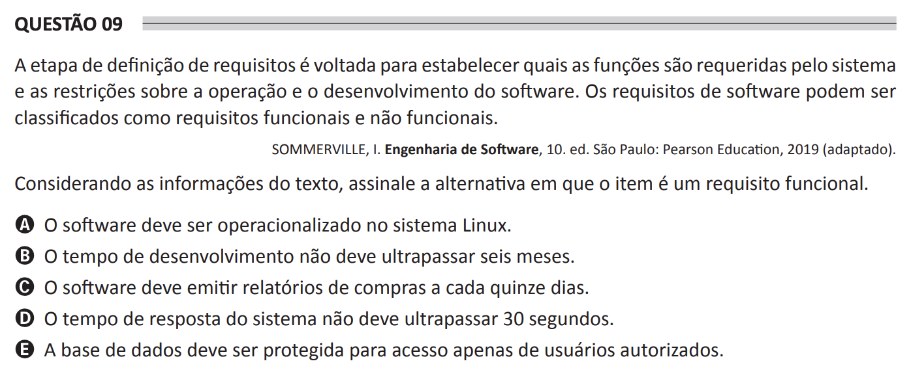

# ENADE 2021 Analysis and Systems Development - Question 09

## Original question image

## English translation

The requirements definition stage is aimed at establishing which functions are required by the system and the constraints on the operation and development of the software. Software requirements can be classified as functional and non-functional requirements.

SOMMERVILLE, I. Software Engineering. 10th ed. São Paulo: Pearson Education, 2019 (adapted).

Considering the information in the text, choose the alternative in which the item is a functional requirement.

A. The software must operate on the Linux system.  
B. The development time must not exceed six months.  
C. The software must issue purchase reports every fifteen days.  
D. The system response time must not exceed 30 seconds.  
E. The database must be protected so that only authorized users can access it.

## Prompt

Answer the question(s) in this image by explaining step by step the reasoning used to answer it/them. Inform if any question is not clear or does not have a possible answer.
