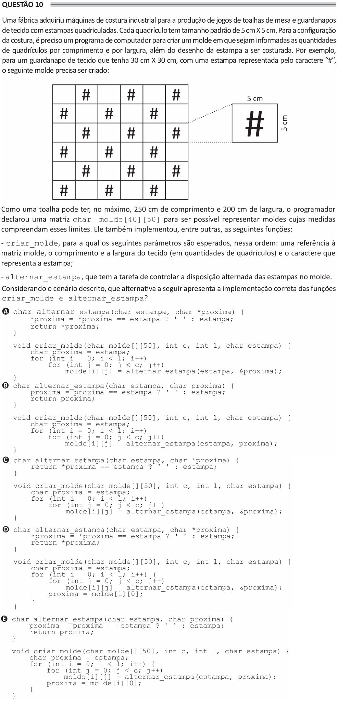

# ENADE 2021 Analysis and Systems Development - Question 10

## Original question image

## English translation

A factory acquired industrial sewing machines for the production of tablecloth and napkin sets made of fabric with checkered patterns. Each square has a standard size of 5 cm × 5 cm. To configure the sewing, a computer program is needed to create a pattern in which the number of squares by length and width is informed, as well as the drawing of the pattern to be sewn. For example, for a square piece of fabric measuring 30 cm × 30 cm, with a pattern represented by the character “#”, the following pattern must be created.

Since a tablecloth may have, at most, 250 cm in length and 200 cm in width, the programmer declared a matrix `char molde[40][50]` to make it possible to represent patterns whose measurements are within these limits. The programmer also implemented, among others, the following functions:

- `criar_molde`, for which the following parameters are expected, in this order: a reference to the `molde` matrix, the length and width of the fabric, expressed as quantities of squares, and the character that represents the pattern;
- `alternar_estampa`, whose task is to control the alternating arrangement of the patterns in the mold.

Considering the scenario described, which of the following alternatives presents the correct implementation of the functions `criar_molde` and `alternar_estampa`?

## Prompt

Answer the question(s) in this image by explaining step by step the reasoning used to answer it/them. Inform if any question is not clear or does not have a possible answer.
