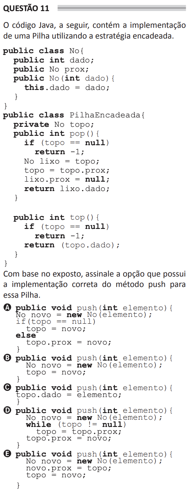

# ENADE 2021 Analysis and Systems Development - Question 11

## Original question image



## English translation

The following Java code contains the implementation of a Stack using a linked strategy.

```java
public class No {
    public int dado;
    public No prox;

    public No(int dado) {
        this.dado = dado;
    }
}

public class PilhaEncadeada {
    private No topo;

    public int pop() {
        if (topo == null)
            return -1;
        No lixo = topo;
        topo = topo.prox;
        lixo.prox = null;
        return lixo.dado;
    }

    public int top() {
        if (topo == null)
            return -1;
        return (topo.dado);
    }
}
```

Based on the information presented, choose the option that contains the correct implementation of the `push` method for this Stack.

## Prompt

Answer the question(s) in this image by explaining step by step the reasoning used to answer it/them. Inform if any question is not clear or does not have a possible answer.
