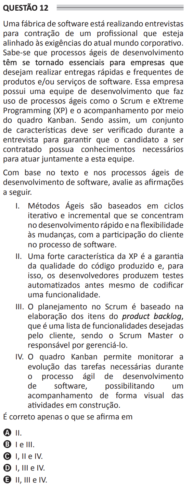

# ENADE 2021 Analysis and Systems Development - Question 12

## Original question image

## English translation

A software factory is conducting interviews to hire a professional aligned with the demands of the current corporate world. It is known that agile development processes have become essential for companies that want to deliver software products and/or services quickly and frequently. This company has a development team that uses agile processes such as Scrum and Extreme Programming (XP), and monitors work through the Kanban board. Therefore, a set of characteristics must be checked during the interview to ensure that the candidate to be hired has the necessary knowledge to work together with this team.

Based on the text and on agile software development processes, evaluate the following statements.

I. Agile Methods are based on iterative and incremental cycles that focus on rapid development and flexibility to changes, with customer participation in the software process.  
II. A strong characteristic of XP is ensuring the quality of the produced code; for this purpose, developers produce automated tests even before coding a feature.  
III. Planning in Scrum is based on preparing the items of the product backlog, which is a list of functionalities desired by the customer, and the Scrum Master is responsible for managing it.  
IV. The Kanban board allows monitoring the progress of the necessary tasks during the agile software development process, enabling visual tracking of activities under construction.

It is correct only what is stated in:

A. II.  
B. I and III.  
C. I, II, and IV.  
D. I, III, and IV.  
E. II, III, and IV.

## Prompt

Answer the question(s) in this image by explaining step by step the reasoning used to answer it/them. Inform if any question is not clear or does not have a possible answer.
