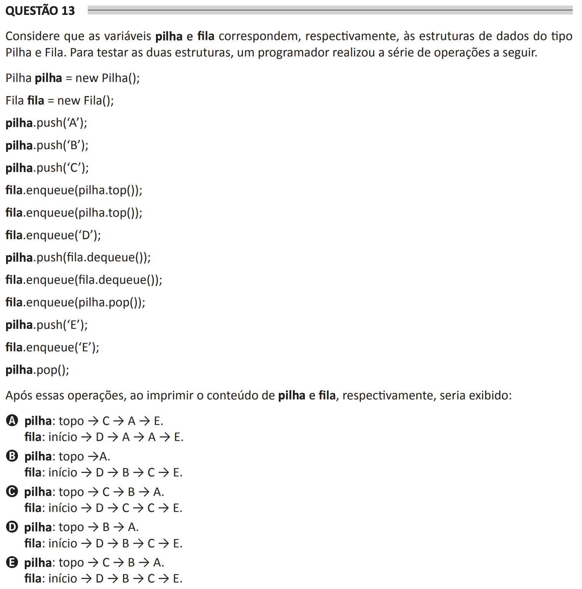

# ENADE 2021 Analysis and Systems Development - Question 13

## Original question image



## English translation

Consider that the variables `pilha` and `fila` correspond, respectively, to the Stack and Queue data structures. To test the two structures, a programmer performed the following sequence of operations.

```java
Pilha pilha = new Pilha();

Fila fila = new Fila();

pilha.push('A');

pilha.push('B');

pilha.push('C');

fila.enqueue(pilha.top());

fila.enqueue(pilha.top());

fila.enqueue('D');

pilha.push(fila.dequeue());

fila.enqueue(fila.dequeue());

fila.enqueue(pilha.pop());

pilha.push('E');

fila.enqueue('E');

pilha.pop();
```

After these operations, when printing the contents of `pilha` and `fila`, respectively, the output would be:

A. stack: top → C → A → E.  
   queue: beginning → D → A → A → E.  

B. stack: top → A.  
   queue: beginning → D → B → C → E.  

C. stack: top → C → B → A.  
   queue: beginning → D → C → C → E.  

D. stack: top → B → A.  
   queue: beginning → D → B → C → E.  

E. stack: top → C → B → A.  
   queue: beginning → D → B → C → E.

## Prompt

Answer the question(s) in this image by explaining step by step the reasoning used to answer it/them. Inform if any question is not clear or does not have a possible answer.
