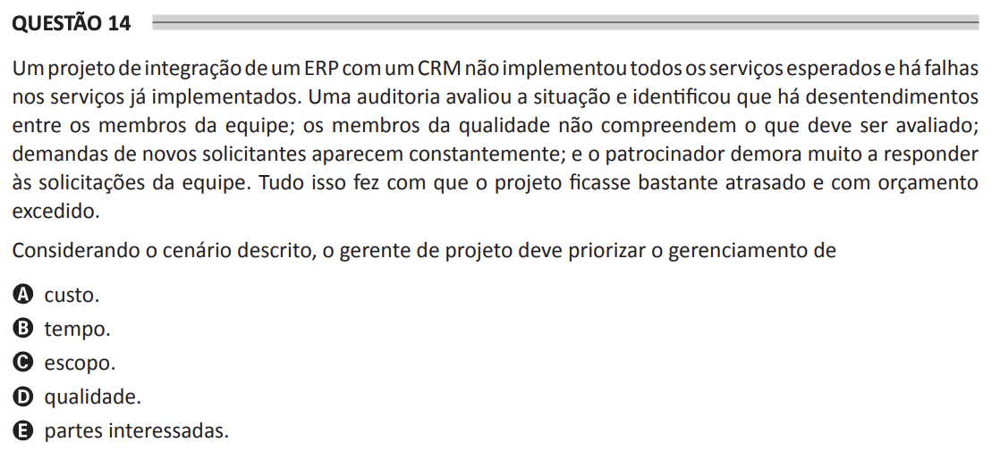

# ENADE 2021 Analysis and Systems Development - Question 14

## Original question image

## English translation

An ERP integration project with a CRM did not implement all the expected services, and there are failures in the services already implemented. An audit evaluated the situation and identified that there are disagreements among team members; the quality team members do not understand what should be evaluated; requests from new stakeholders appear constantly; and the sponsor takes too long to respond to the team’s requests. All of this caused the project to become very delayed and over budget.

Considering the scenario described, the project manager should prioritize the management of:

A. cost.  
B. time.  
C. scope.  
D. quality.  
E. stakeholders.

## Prompt

Answer the question(s) in this image by explaining step by step the reasoning used to answer it/them. Inform if any question is not clear or does not have a possible answer.
