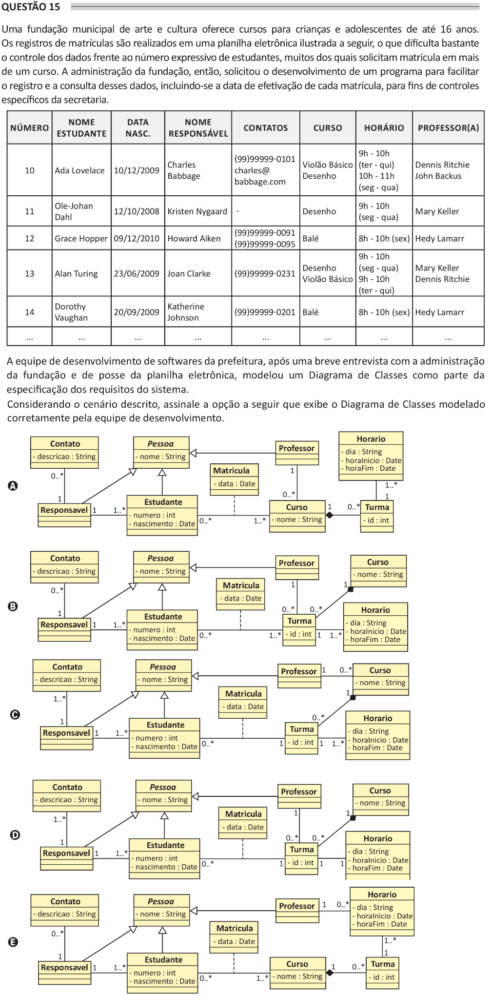

# ENADE 2021 Analysis and Systems Development - Question 15

## Original question image

## English translation

A municipal art and culture foundation offers courses for children and teenagers up to 16 years old. Enrollment records are kept in an electronic spreadsheet, as illustrated below, which makes data control quite difficult given the large number of students, many of whom request enrollment in more than one course. The foundation’s administration then requested the development of a program to facilitate the recording and querying of these data, including the date on which each enrollment was completed, for specific administrative controls.

The city hall software development team, after a brief interview with the foundation administration and after analyzing the spreadsheet, modeled a Class Diagram as part of the system requirements specification.

Considering the scenario described, choose the option that shows the Class Diagram correctly modeled by the development team.

## Prompt

Answer the question(s) in this image by explaining step by step the reasoning used to answer it/them. Inform if any question is not clear or does not have a possible answer.
