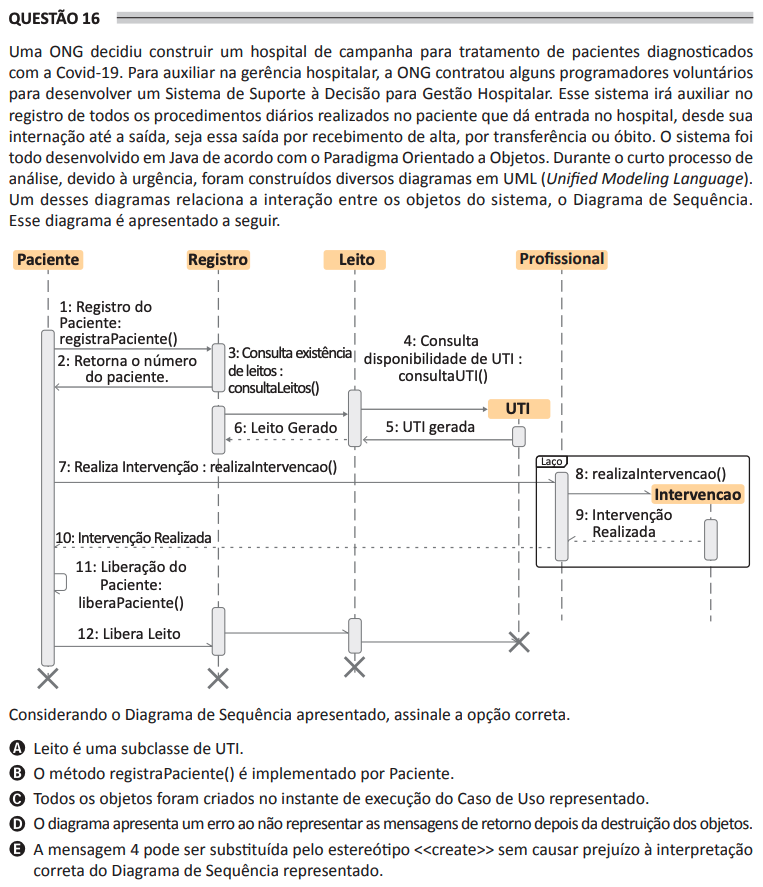

# ENADE 2021 Analysis and Systems Development - Question 16

## Original question image

## English translation

An NGO decided to build a field hospital to treat patients diagnosed with Covid-19. To assist hospital management, the NGO hired some volunteer programmers to develop a Decision Support System for Hospital Management. This system will help record all the daily procedures performed on the patient, from admission to the hospital, through hospitalization, until discharge, transfer, or death. The system was entirely developed in Java according to the Object-Oriented Paradigm. During the short analysis process, due to urgency, several UML (Unified Modeling Language) diagrams were built. One of these diagrams relates the interaction between the system objects: the Sequence Diagram. This diagram is presented below.

Considering the Sequence Diagram presented, choose the correct option.

A. `Leito` is a subclass of `UTI`.  
B. The method `registraPaciente()` is implemented by `Paciente`.  
C. All objects were created at the execution instant of the represented Use Case.  
D. The diagram has an error because it does not represent return messages after object destruction.  
E. Message 4 may be replaced by the stereotype `<<create>>` without harming the correct interpretation of the represented Sequence Diagram.

## Prompt

Answer the question(s) in this image by explaining step by step the reasoning used to answer it/them. Inform if any question is not clear or does not have a possible answer.
