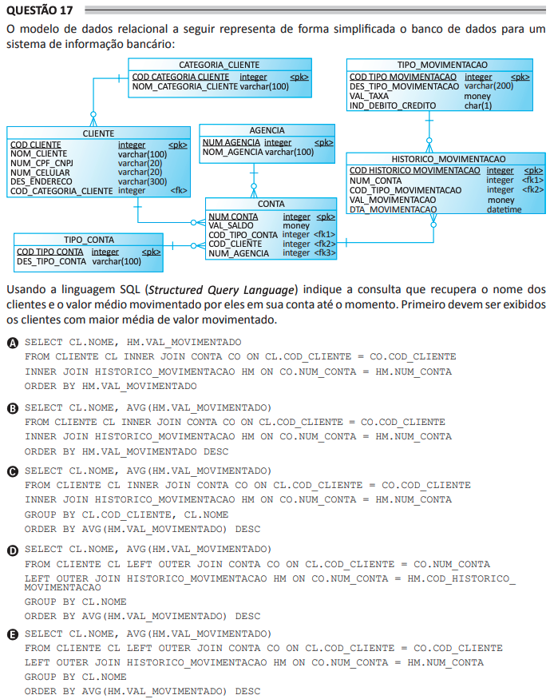

# ENADE 2021 Analysis and Systems Development - Question 17

## Original question image



## English translation

The relational data model below represents, in simplified form, the database for a banking information system.

Using SQL (Structured Query Language), indicate the query that retrieves the names of clients and the average amount moved by them in their account up to the present moment. The clients with the highest average moved amount must be displayed first.

A.
```sql
SELECT CL.NOME, HM.VAL_MOVIMENTADO
FROM CLIENTE CL INNER JOIN CONTA CO ON CL.COD_CLIENTE = CO.COD_CLIENTE
INNER JOIN HISTORICO_MOVIMENTACAO HM ON CO.NUM_CONTA = HM.NUM_CONTA
ORDER BY HM.VAL_MOVIMENTADO
```

B.
```sql
SELECT CL.NOME, AVG(HM.VAL_MOVIMENTADO)
FROM CLIENTE CL INNER JOIN CONTA CO ON CL.COD_CLIENTE = CO.COD_CLIENTE
INNER JOIN HISTORICO_MOVIMENTACAO HM ON CO.NUM_CONTA = HM.NUM_CONTA
ORDER BY HM.VAL_MOVIMENTADO DESC
```

C.
```sql
SELECT CL.NOME, AVG(HM.VAL_MOVIMENTADO)
FROM CLIENTE CL INNER JOIN CONTA CO ON CL.COD_CLIENTE = CO.COD_CLIENTE
INNER JOIN HISTORICO_MOVIMENTACAO HM ON CO.NUM_CONTA = HM.NUM_CONTA
GROUP BY CL.COD_CLIENTE, CL.NOME
ORDER BY AVG(HM.VAL_MOVIMENTADO) DESC
```

D.
```sql
SELECT CL.NOME, AVG(HM.VAL_MOVIMENTADO)
FROM CLIENTE CL LEFT OUTER JOIN CONTA CO ON CL.COD_CLIENTE = CO.NUM_CONTA
LEFT OUTER JOIN HISTORICO_MOVIMENTACAO HM ON CO.NUM_CONTA = HM.COD_HISTORICO_MOVIMENTACAO
GROUP BY CL.NOME
ORDER BY AVG(HM.VAL_MOVIMENTADO) DESC
```

E.
```sql
SELECT CL.NOME, AVG(HM.VAL_MOVIMENTADO)
FROM CLIENTE CL LEFT OUTER JOIN CONTA CO ON CL.COD_CLIENTE = CO.COD_CLIENTE
LEFT OUTER JOIN HISTORICO_MOVIMENTACAO HM ON CO.NUM_CONTA = HM.NUM_CONTA
GROUP BY CL.NOME
ORDER BY AVG(HM.VAL_MOVIMENTADO) DESC
```

## Prompt

Answer the question(s) in this image by explaining step by step the reasoning used to answer it/them. Inform if any question is not clear or does not have a possible answer.
