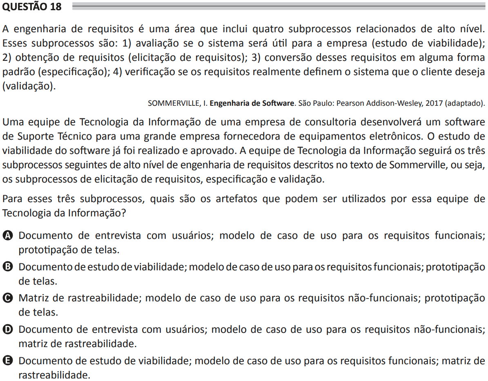

# ENADE 2021 Analysis and Systems Development - Question 18

## Original question image

## English translation

Requirements engineering is an area that includes four high-level related subprocesses. These subprocesses are: (1) assessing whether the system will be useful for the company, known as the feasibility study; (2) obtaining requirements, known as requirements elicitation; (3) converting these requirements into some standard form, known as specification; and (4) verifying whether the requirements really define the system that the client wants, known as validation.

SOMMERVILLE, I. Software Engineering. São Paulo: Pearson Addison-Wesley, 2017 (adapted).

An Information Technology team from a consulting company will develop technical support software for a large company that supplies electronic equipment. The software feasibility study has already been carried out and approved. The Information Technology team will follow the next three high-level requirements engineering subprocesses described in Sommerville’s text, namely requirements elicitation, specification, and validation.

For these three subprocesses, which artifacts can be used by this Information Technology team?

A. User interview document; use case model for functional requirements; screen prototyping.  
B. Feasibility study document; use case model for functional requirements; screen prototyping.  
C. Traceability matrix; use case model for non-functional requirements; screen prototyping.  
D. User interview document; use case model for non-functional requirements; traceability matrix.  
E. Feasibility study document; use case model for functional requirements; traceability matrix.

## Prompt

Answer the question(s) in this image by explaining step by step the reasoning used to answer it/them. Inform if any question is not clear or does not have a possible answer.
