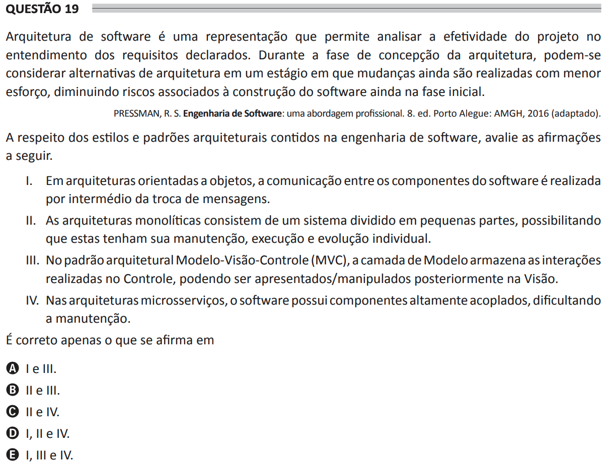

# ENADE 2021 Analysis and Systems Development - Question 19

## Original question image

## English translation

Software architecture is a representation that allows the effectiveness of the design to be analyzed in terms of understanding the stated requirements. During the architecture conception phase, architectural alternatives can be considered at a stage in which changes are still made with less effort, reducing risks associated with software construction while still in the initial phase.

PRESSMAN, R. S. Software Engineering: A Practitioner’s Approach. 8th ed. Porto Alegre: AMGH, 2016 (adapted).

Regarding architectural styles and patterns contained in software engineering, evaluate the following statements.

I. In object-oriented architectures, communication between software components is carried out through the exchange of messages.  
II. Monolithic architectures consist of a system divided into small parts, allowing each part to have individual maintenance, execution, and evolution.  
III. In the Model-View-Controller (MVC) architectural pattern, the Model layer stores the interactions performed in the Controller, which can later be presented/manipulated in the View.  
IV. In microservices architectures, the software has highly coupled components, making maintenance difficult.

It is correct only what is stated in:

A. I and III.  
B. II and III.  
C. II and IV.  
D. I, II, and IV.  
E. I, III, and IV.

## Prompt

Answer the question(s) in this image by explaining step by step the reasoning used to answer it/them. Inform if any question is not clear or does not have a possible answer.
