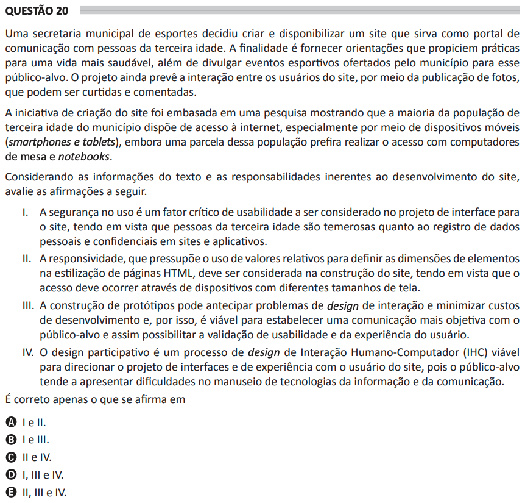

# ENADE 2021 Analysis and Systems Development - Question 20

## Original question image

## English translation

A municipal sports department decided to create and make available a website that serves as a communication portal with elderly people. The purpose is to provide guidance that encourages healthier practices, as well as to publicize sports events offered by the municipality to this target audience. The project also includes interaction among website users through the publication of photos, which may be liked and commented on.

The initiative to create the website was based on research showing that most of the municipality’s elderly population has internet access, especially through mobile devices, such as smartphones and tablets, although part of this population prefers to access it using desktop computers and notebooks.

Considering the information in the text and the responsibilities inherent to the development of the website, evaluate the following statements.

I. Security in use is a critical usability factor to be considered in the interface design for the website, since elderly people are afraid of registering personal and confidential data on websites and applications.  
II. Responsiveness, which presupposes the use of relative values to define the dimensions of elements in HTML page styling, should be considered in the construction of the website, since access should occur through devices with different screen sizes.  
III. The construction of prototypes can anticipate interaction design problems and minimize development costs; therefore, it is feasible to establish more objective communication with the target audience and enable validation of usability and user experience.  
IV. Participatory design is a viable Human-Computer Interaction (HCI) interaction design process to guide the design of the website interfaces and user experience, since the target audience tends to have difficulties handling information and communication technologies.

It is correct only what is stated in:

A. I and II.  
B. I and III.  
C. II and IV.  
D. I, III, and IV.  
E. II, III, and IV.

## Prompt

Answer the question(s) in this image by explaining step by step the reasoning used to answer it/them. Inform if any question is not clear or does not have a possible answer.
