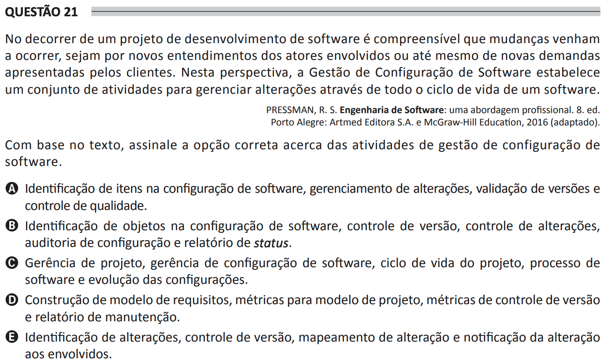

# ENADE 2021 Analysis and Systems Development - Question 21

## Original question image

## English translation

During a software development project, it is understandable that changes may occur, either due to new understandings by the actors involved or even due to new demands presented by clients. From this perspective, Software Configuration Management establishes a set of activities to manage changes throughout the entire software life cycle.

PRESSMAN, R. S. Software Engineering: A Practitioner’s Approach. 8th ed. Porto Alegre: Artmed Editora S.A. and McGraw-Hill Education, 2016 (adapted).

Based on the text, choose the correct option regarding software configuration management activities.

A. Identification of items in software configuration, change management, version validation, and quality control.  
B. Identification of objects in software configuration, version control, change control, configuration audit, and status reporting.  
C. Project management, software configuration management, project life cycle, software process, and evolution of configurations.  
D. Construction of requirements model, metrics for design model, version control metrics, and maintenance report.  
E. Identification of changes, version control, change mapping, and notification of changes to those involved.

## Prompt

Answer the question(s) in this image by explaining step by step the reasoning used to answer it/them. Inform if any question is not clear or does not have a possible answer.
