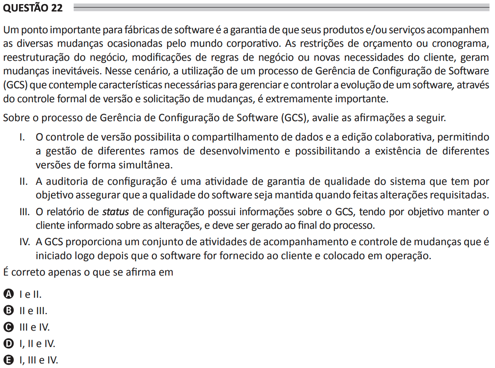

# ENADE 2021 Analysis and Systems Development - Question 22

## Original question image

## English translation

An important point for software factories is ensuring that their products and/or services keep up with the various changes caused by the corporate world. Budget or schedule constraints, business restructuring, modifications to business rules, or new client needs generate inevitable changes. In this scenario, the use of a Software Configuration Management (SCM) process that includes the necessary characteristics to manage and control the evolution of software through formal version control and change requests is extremely important.

Regarding the Software Configuration Management (SCM) process, evaluate the following statements.

I. Version control enables data sharing and collaborative editing, allowing the management of different development branches and enabling the simultaneous existence of different versions.  
II. Configuration auditing is a system quality assurance activity whose objective is to ensure that software quality is maintained when requested changes are made.  
III. The configuration status report contains information about the SCM process, with the objective of keeping the client informed about changes, and must be generated at the end of the process.  
IV. SCM provides a set of activities for monitoring and controlling changes that begins shortly after the software is delivered to the client and put into operation.

It is correct only what is stated in:

A. I and II.  
B. II and III.  
C. III and IV.  
D. I, II, and IV.  
E. I, III, and IV.

## Prompt

Answer the question(s) in this image by explaining step by step the reasoning used to answer it/them. Inform if any question is not clear or does not have a possible answer.
