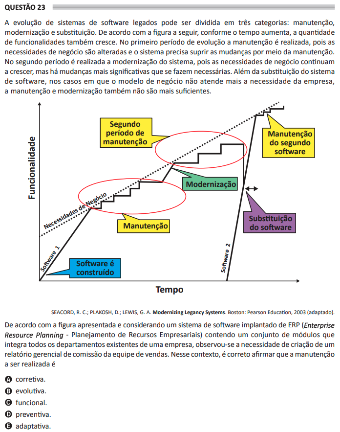

# ENADE 2021 Analysis and Systems Development - Question 23

## Original question image

## English translation

The evolution of legacy software systems can be divided into three categories: maintenance, modernization, and replacement. According to the figure below, as time increases, the number of functionalities also increases. In the first period of evolution, maintenance is performed because business needs are changed and the system must meet these changes through maintenance. In the second period, system modernization is performed because business needs continue to grow, but the more significant changes that are made become necessary. In the case of software replacement, when the business model no longer meets the company’s needs, maintenance and modernization are no longer sufficient.

According to the figure presented, and considering a software system deployed for ERP (Enterprise Resource Planning) containing a set of modules that integrates all existing departments of a company, there was a need to create a management report for the sales commission team. In this context, it is correct to state that the maintenance to be performed is:

A. corrective.  
B. evolutionary.  
C. functional.  
D. preventive.  
E. adaptive.

## Prompt

Answer the question(s) in this image by explaining step by step the reasoning used to answer it/them. Inform if any question is not clear or does not have a possible answer.
