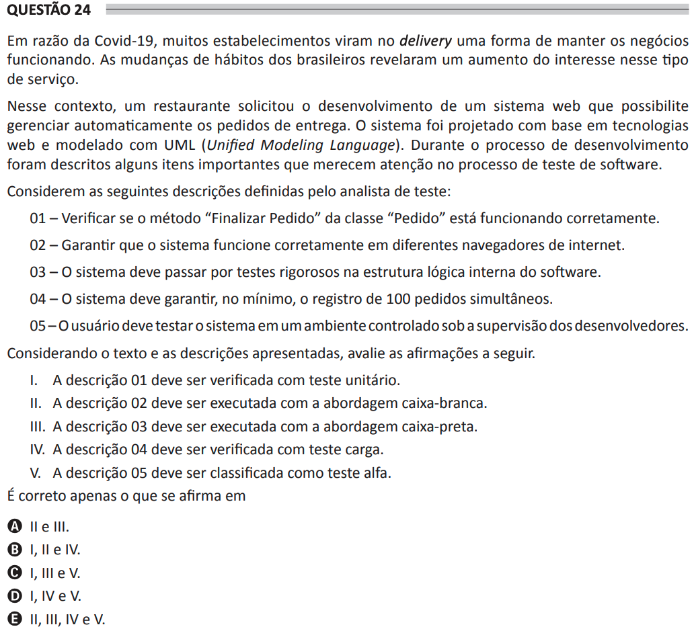

# ENADE 2021 Analysis and Systems Development - Question 24

## Original question image

## English translation

Due to Covid-19, many establishments saw delivery as a way to keep their businesses running. Changes in Brazilians’ habits revealed an increase in interest in this type of service.

In this context, a restaurant requested the development of a web system that would automatically manage delivery orders. The system was designed based on web technologies and modeled with UML (Unified Modeling Language). During the development process, some important items were described that deserve attention in the software testing process.

Consider the following descriptions defined by the test analyst:

01 — Verify whether the “Finalize Order” method of the “Order” class is working correctly.  
02 — Ensure that the system works correctly in different internet browsers.  
03 — The system must undergo rigorous tests in the internal logical structure of the software.  
04 — The system must guarantee, at minimum, the registration of 100 simultaneous orders.  
05 — The user must test the system in a controlled environment under the supervision of the developers.

Considering the text and the descriptions presented, evaluate the following statements.

I. Description 01 must be verified with unit testing.  
II. Description 02 must be executed using the white-box approach.  
III. Description 03 must be executed using the black-box approach.  
IV. Description 04 must be verified with load testing.  
V. Description 05 must be classified as alpha testing.

It is correct only what is stated in:

A. II and III.  
B. I, II, and IV.  
C. I, III, and V.  
D. I, IV, and V.  
E. II, III, IV, and V.

## Prompt

Answer the question(s) in this image by explaining step by step the reasoning used to answer it/them. Inform if any question is not clear or does not have a possible answer.
