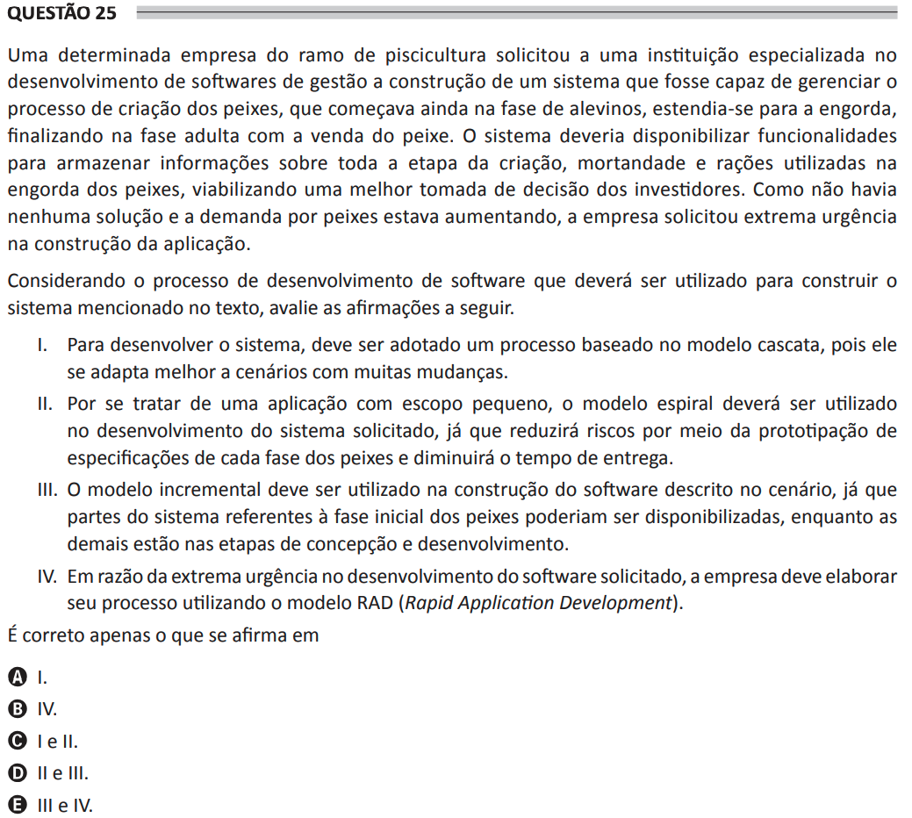

# ENADE 2021 Analysis and Systems Development - Question 25

## Original question image

## English translation

A company in the fish farming sector requested a specialized software development institution to build a system capable of managing the fish breeding process, which begins in the fingerling phase, continues through fattening, and ends in the adult phase with the sale of the fish. The system should provide functionalities to store information about the entire breeding stage, mortality, and feed rations used in fish fattening, enabling better decision-making by investors. Since there was no existing solution and the demand for fish was increasing, the company requested extreme urgency in building the application.

Considering the software development process that should be used to build the system mentioned in the text, evaluate the following statements.

I. To develop the system, a process based on the waterfall model should be adopted, since it adapts better to scenarios with many changes.  
II. Since it is an application with a small scope, the spiral model should be used in developing the requested system, since it will reduce risks through prototyping specifications for each fish phase and reduce delivery time.  
III. The incremental model should be used to build the software described in the scenario, since parts of the system related to the initial fish phase could be made available while the others are still in the conception and development stages.  
IV. Due to the extreme urgency in software development, the company should design its process using the RAD (Rapid Application Development) model.

It is correct only what is stated in:

A. I.  
B. IV.  
C. I and II.  
D. II and III.  
E. III and IV.

## Prompt

Answer the question(s) in this image by explaining step by step the reasoning used to answer it/them. Inform if any question is not clear or does not have a possible answer.
