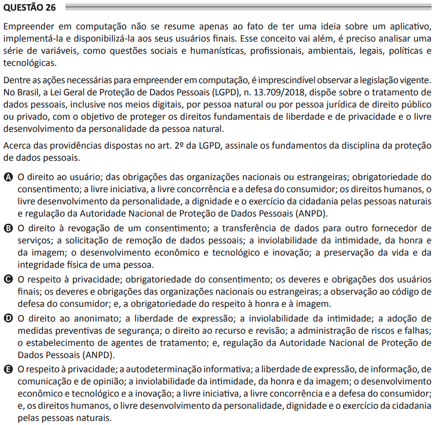

# ENADE 2021 Analysis and Systems Development - Question 26

## Original question image

## English translation

Entrepreneurship in computing is not limited to having an idea for an application, implementing it, and making it available to end users. This concept goes further; it is necessary to analyze a series of variables, such as social and humanistic, professional, environmental, legal, political, and technological issues.

Among the necessary questions for entrepreneurship in computing, observing current legislation is essential. In Brazil, the General Personal Data Protection Law (LGPD), Law No. 13,709/2018, provides for the processing of personal data, including in digital media, by natural persons or legal entities under public or private law, with the objective of protecting the fundamental rights of freedom and privacy and the free development of the personality of the natural person.

Regarding the provisions of Article 2 of the LGPD, choose the foundations of the discipline of personal data protection.

A. The user’s rights; obligations of national or foreign organizations; mandatory consent; free enterprise, free competition, and consumer protection; human rights, free development of personality, dignity, and the exercise of citizenship by natural persons; and regulation by the National Data Protection Authority (ANPD).  
B. The right to revoke consent; the transfer of data to another service provider; the request to remove personal data; the inviolability of intimacy, honor, and image; economic and technological development and innovation; the preservation of life and physical integrity of a person.  
C. Respect for privacy; mandatory consent; duties and obligations of end users; duties and obligations of national or foreign organizations; compliance with the consumer protection code; and mandatory respect for honor and image.  
D. The right to anonymity; freedom of expression; inviolability of intimacy; adoption of preventive security measures; the right to appeal and review; risk and failure management; establishment of data processing agents; and regulation by the National Data Protection Authority (ANPD).  
E. Respect for privacy; informational self-determination; freedom of expression, information, communication, and opinion; inviolability of intimacy, honor, and image; economic and technological development and innovation; free enterprise, free competition, and consumer protection; and human rights, free development of personality, dignity, and the exercise of citizenship by natural persons.

## Prompt

Answer the question(s) in this image by explaining step by step the reasoning used to answer it/them. Inform if any question is not clear or does not have a possible answer.
