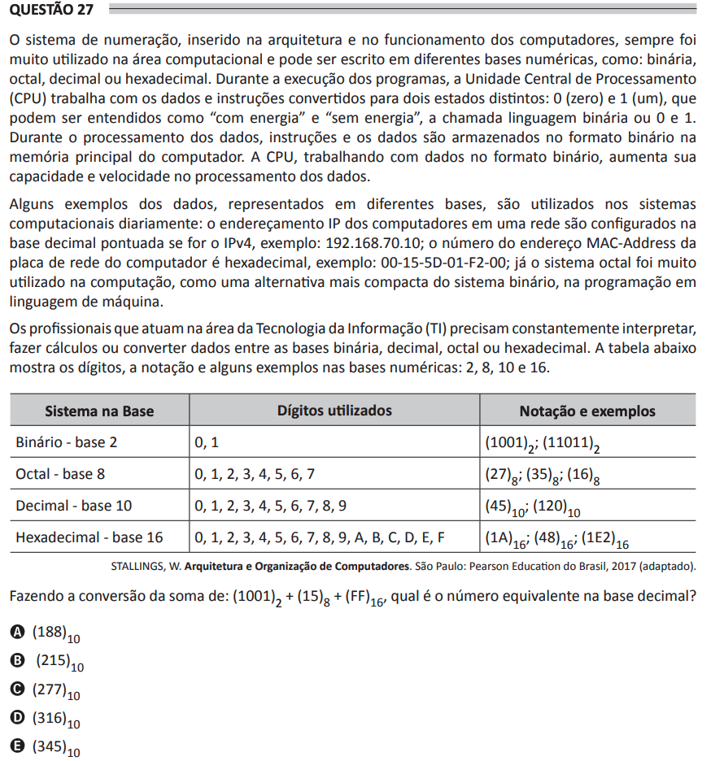

# ENADE 2021 Analysis and Systems Development - Question 27

## Original question image

## English translation

The numbering system, inserted in the architecture and operation of computers, has always been widely used in the computing area and can be written in different numerical bases, such as binary, octal, decimal, or hexadecimal. During program execution, the Central Processing Unit (CPU) works with data and instructions contained by two distinct states: 0 (zero) and 1 (one), which can be understood as “with energy” and “without energy”, the so-called binary language, 0 and 1. During data processing, instructions and data are stored in binary format in the computer’s main memory. The CPU, working with data in binary format, increases its capacity and speed in data processing.

Some examples of data, represented in different bases, are used daily in computer systems: the IP address of computers on a network is configured in dotted decimal form if it is IPv4, for example, 192.168.70.10; the MAC address number of the computer’s network card is hexadecimal, for example, 00-15-5D-01-F2-00; and the octal system has been widely used in computing as a more compact alternative to the binary system in machine language programming.

Information Technology (IT) professionals constantly need to interpret, calculate, or convert data among binary, decimal, octal, or hexadecimal bases. The table below shows the digits, notation, and some examples in bases 2, 8, 10, and 16.

Converting the sum `(1001)₂ + (15)₈ + (FF)₁₆`, what is the equivalent number in decimal base?

A. `(188)₁₀`  
B. `(215)₁₀`  
C. `(277)₁₀`  
D. `(316)₁₀`  
E. `(345)₁₀`

## Prompt

Answer the question(s) in this image by explaining step by step the reasoning used to answer it/them. Inform if any question is not clear or does not have a possible answer.
