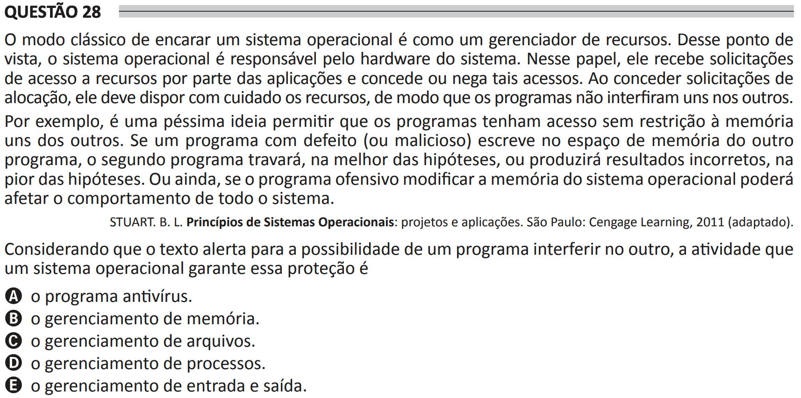

# ENADE 2021 Analysis and Systems Development - Question 28

## Original question image

## English translation

The classical way of viewing an operating system is as a resource manager. From this point of view, the operating system is responsible for the system hardware. In this role, it receives requests for access to resources from applications and grants or denies such access. When granting allocation requests, it must carefully arrange the resources so that programs do not interfere with each other.

For example, it is a terrible idea to allow programs unrestricted access to each other’s memory. If a defective or malicious program writes in the memory space of another program, the second program will crash, in the best case, or produce incorrect results, in the worst case. Furthermore, if the offending program modifies the memory of the operating system, it may affect the behavior of the entire system.

STUART, B. L. Principles of Operating Systems: Design and Applications. São Paulo: Cengage Learning, 2011 (adapted).

Considering that the text warns about the possibility of one program interfering with another, the activity through which an operating system guarantees this protection is:

A. the antivirus program.  
B. memory management.  
C. file management.  
D. process management.  
E. input and output management.

## Prompt

Answer the question(s) in this image by explaining step by step the reasoning used to answer it/them. Inform if any question is not clear or does not have a possible answer.
