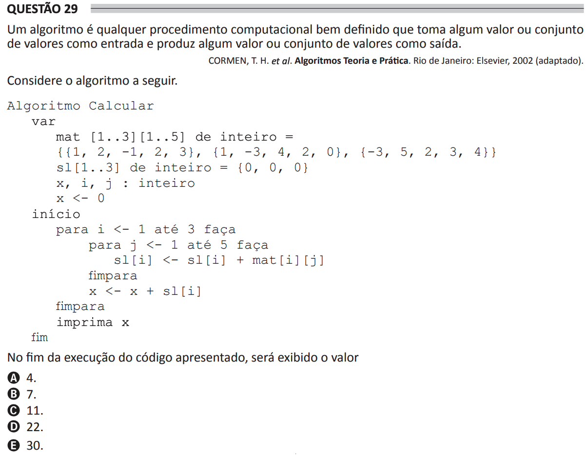

# ENADE 2021 Analysis and Systems Development - Question 29

## Original question image



## English translation

An algorithm is any well-defined computational procedure that takes some value or set of values as input and produces some value or set of values as output.

CORMEN, T. H. et al. Introduction to Algorithms. Rio de Janeiro: Elsevier, 2002 (adapted).

Consider the following algorithm.

```text
Algorithm Calculate
    var
        mat [1..3][1..5] of integer =
            {{1, 2, -1, 2, 3}, {1, -3, 4, 2, 0}, {-3, 5, 2, 3, 4}}
        sl [1..3] of integer = {0, 0, 0}
        x, i, j : integer
        x <- 0
    begin
        for i <- 1 to 3 do
            for j <- 1 to 5 do
                sl[i] <- sl[i] + mat[i][j]
            endfor
            x <- x + sl[i]
        endfor
        print x
    end
```

At the end of the execution of the code presented, the value displayed will be:

A. 4.  
B. 7.  
C. 11.  
D. 22.  
E. 30.

## Prompt

Answer the question(s) in this image by explaining step by step the reasoning used to answer it/them. Inform if any question is not clear or does not have a possible answer.
