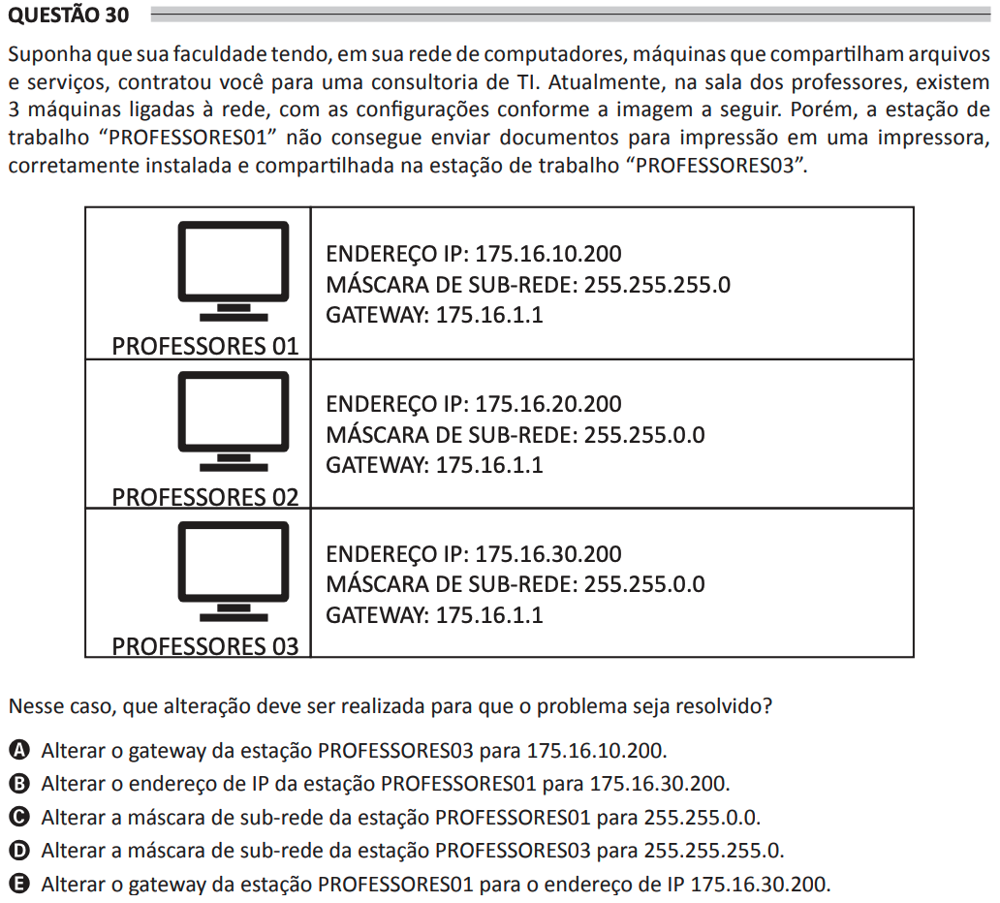

# ENADE 2021 Analysis and Systems Development - Question 30

## Original question image

## English translation

Suppose that your college, which has computers in its network that share files and services, hired you for an IT consulting job. Currently, in the teachers’ room, there are 3 machines connected to the network, with the configurations shown in the image below. However, the workstation “PROFESSORES01” is unable to send documents for printing to a printer that is correctly installed and shared on the workstation “PROFESSORES03”.

In this case, what change should be made so that the problem is solved?

A. Change the gateway of workstation PROFESSORES03 to 175.16.10.200.  
B. Change the IP address of workstation PROFESSORES01 to 175.16.30.200.  
C. Change the subnet mask of workstation PROFESSORES01 to 255.255.0.0.  
D. Change the subnet mask of workstation PROFESSORES03 to 255.255.255.0.  
E. Change the gateway of workstation PROFESSORES01 to the IP address 175.16.30.200.

## Prompt

Answer the question(s) in this image by explaining step by step the reasoning used to answer it/them. Inform if any question is not clear or does not have a possible answer.
