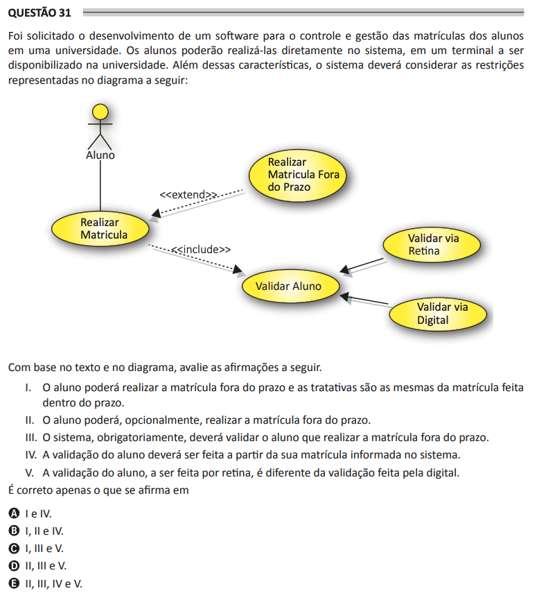

# ENADE 2021 Analysis and Systems Development - Question 31

## Original question image

## English translation

The development of software was requested for controlling and managing student enrollments at a university. Students will be able to perform enrollments directly in the system, using a terminal made available at the university. In addition to these characteristics, the system must consider the restrictions represented in the following diagram.

Based on the text and the diagram, evaluate the following statements.

I. The student will be able to enroll after the deadline, and the handling procedures are the same as those for enrollment performed within the deadline.  
II. The student may, optionally, perform enrollment after the deadline.  
III. The system must obligatorily validate the student who enrolls after the deadline.  
IV. Student validation must be performed based on the enrollment entered in the system.  
V. Student validation, when performed by retina, is different from validation performed by fingerprint.

It is correct only what is stated in:

A. I and IV.  
B. I, II, and IV.  
C. I, III, and V.  
D. II, III, and V.  
E. II, III, IV, and V.

## Prompt

Answer the question(s) in this image by explaining step by step the reasoning used to answer it/them. Inform if any question is not clear or does not have a possible answer.
