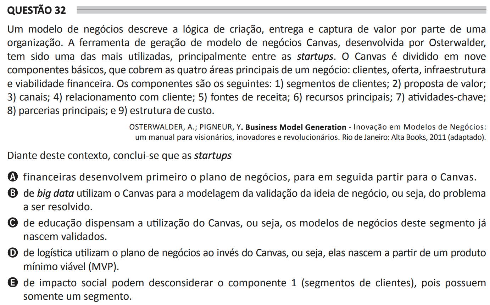

# ENADE 2021 Analysis and Systems Development - Question 32

## Original question image

## English translation

A business model describes the logic of creating, delivering, and capturing value by an organization. The Business Model Canvas generation tool, developed by Osterwalder, has been one of the most widely used, mainly among startups. The Canvas is divided into nine basic components, which cover the four main areas of a business: customers, offer, infrastructure, and financial viability. The components are the following: (1) customer segments; (2) value proposition; (3) channels; (4) customer relationships; (5) revenue streams; (6) key resources; (7) key activities; (8) key partnerships; and (9) cost structure.

OSTERWALDER, A.; PIGNEUR, Y. Business Model Generation: Innovation in Business Models — a handbook for visionaries, innovators, and revolutionaries. Rio de Janeiro: Alta Books, 2011 (adapted).

Given this context, it can be concluded that startups:

A. in finance first develop the business plan and then move on to the Canvas.  
B. in big data use the Canvas to model the validation of the business idea, that is, the problem to be solved.  
C. in education do not need to use the Canvas, that is, business models in this segment are already born validated.  
D. in logistics use the business plan instead of the Canvas, that is, they are born from a minimum viable product (MVP).  
E. in social impact may disregard component 1, customer segments, because they have only one segment.

## Prompt

Answer the question(s) in this image by explaining step by step the reasoning used to answer it/them. Inform if any question is not clear or does not have a possible answer.
