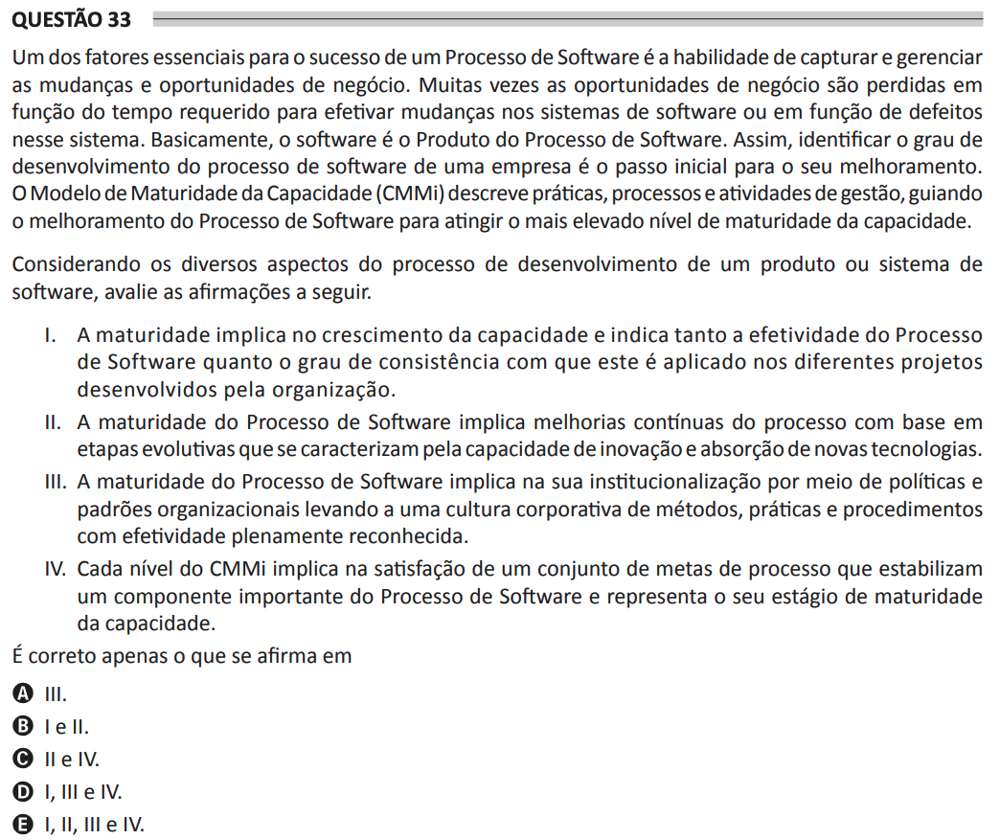

# ENADE 2021 Analysis and Systems Development - Question 33

## Original question image

## English translation

One of the essential factors for the success of a Software Process is the ability to capture and manage changes and business opportunities. Often, business opportunities are lost due to the time required to implement changes in software systems or due to defects in those systems. Basically, software is the Product of the Software Process. Thus, identifying the level of development of a company’s software process is the initial step toward its improvement. The Capability Maturity Model Integration (CMMi) describes management practices, processes, and activities, guiding the improvement of the Software Process to achieve the highest level of capability maturity.

Considering the various aspects of the development process of a software product or system, evaluate the following statements.

I. Maturity implies the growth of capability and indicates both the effectiveness of the Software Process and the degree of consistency with which it is applied in the organization’s different projects.  
II. Software Process maturity implies continuous process improvements based on evolutionary stages characterized by the capacity for innovation and adoption of new technologies.  
III. Software Process maturity implies its institutionalization through organizational policies and standards, leading to a corporate culture of methods, practices, and procedures with fully recognized effectiveness.  
IV. Each CMMi level implies the satisfaction of a set of process goals that stabilize an important component of the Software Process and represent its stage of capability maturity.

It is correct only what is stated in:

A. III.  
B. I and II.  
C. II and IV.  
D. I, III, and IV.  
E. I, II, III, and IV.

## Prompt

Answer the question(s) in this image by explaining step by step the reasoning used to answer it/them. Inform if any question is not clear or does not have a possible answer.
