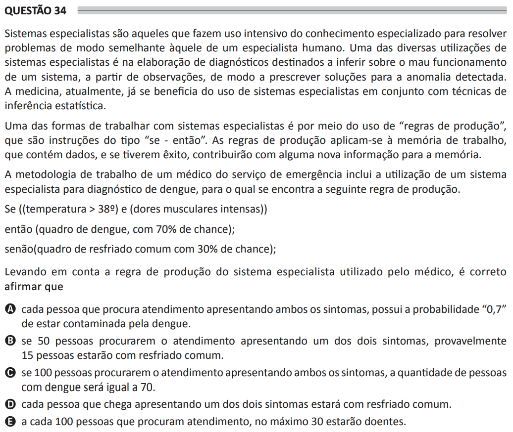

# ENADE 2021 Analysis and Systems Development - Question 34

## Original question image

## English translation

Expert systems are those that make intensive use of specialized knowledge to solve problems in a way similar to that of a human expert. One of the many uses of expert systems is in the development of diagnoses intended to infer the malfunctioning of a system from observations, in order to prescribe solutions for the detected anomaly. Medicine currently benefits from the use of expert systems together with techniques involving statistical inference.

One way to work with expert systems is through the use of “production rules”, which are instructions of the “if-then” type. Production rules are applied to working memory, which contains data, and if they are successful, they contribute some new information to memory.

The working methodology of a physician in the emergency service includes the use of an expert system for dengue diagnosis, for which the following production rule is found.

If ((temperature > 38º) and (intense muscle pain))

then (dengue condition, with 70% chance);

else (common cold condition, with 30% chance);

Taking into account the production rule of the expert system used by the physician, it is correct to state that:

A. each person seeking care and presenting both symptoms has a probability of “0.7” of being infected with dengue.  
B. if 50 people seek care presenting one of the two symptoms, probably 15 people will have a common cold.  
C. if 100 people seek care presenting both symptoms, the number of people with dengue will be exactly 70.  
D. each person arriving with one of the two symptoms will have a common cold.  
E. for every 100 people seeking care, at most 30 will be sick.

## Prompt

Answer the question(s) in this image by explaining step by step the reasoning used to answer it/them. Inform if any question is not clear or does not have a possible answer.
