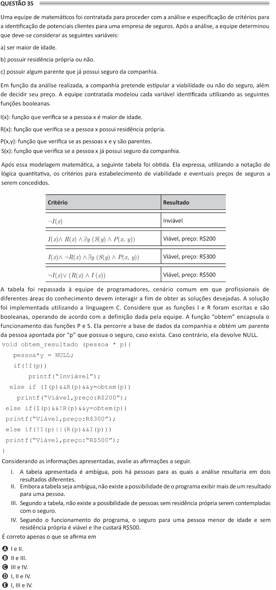

# ENADE 2021 Analysis and Systems Development - Question 35

## Original question image



## English translation

A team of mathematicians was hired to analyze and specify criteria for identifying potential clients for an insurance company. After the analysis, the team determined that the following variables should be considered:

a) being of legal age.

b) owning a residence or not.

c) having a relative who has already had insurance from the company.

Based on the analysis performed, the company intends to determine whether the insurance is viable or not, as well as decide its price. The hired team modeled each identified variable using the following Boolean functions.

I(x): function that checks whether person x is of legal age.  
R(x): function that checks whether person x owns a residence.  
P(x,y): function that checks whether persons x and y are relatives.  
S(x): function that checks whether person x has already had insurance from the company.

After this mathematical modeling, the following table was obtained. Using quantitative logic notation, it expresses the criteria for establishing the feasibility and possible prices of insurance to be granted.

Criterion / Result:

- ¬I(x) → Not viable
- I(x) ∧ R(x) ∧ ∃y (S(y) ∧ P(x,y)) → Viable, price: R$200
- I(x) ∧ ¬R(x) ∧ ∃y (S(y) ∧ P(x,y)) → Viable, price: R$300
- ¬I(x) ∨ (R(x) ∧ I(x)) → Viable, price: R$500

The table was passed on to the team of programmers, a common scenario in which professionals from different areas of knowledge must interact in order to obtain the desired solutions. The solution was implemented using the C language. Consider that the functions I and R were written and are Boolean, operating according to the definition given by the team. The function `obtem` encapsulates the operation of functions P and S. It searches the company database and obtains a relative of the person indicated by `p` who has insurance, if one exists. Otherwise, it returns NULL.

```c
void obtem_resultado(pessoa * p) {

    pessoa *y = NULL;

    if(!I(p))
        printf("Inviável");

    else if (I(p) && R(p) && y=obtem(p))
        printf("Viável, preço:R$200");

    else if(I(p) && !R(p) && y=obtem(p))
        printf("Viável, preço:R$300");

    else if(!I(p) || (R(p) && I(p)))
        printf("Viável, preço:R$500");
}
```

Considering the information presented, evaluate the following statements.

I. The table presented is ambiguous, because there are people for whom the analysis would result in two different outcomes.  
II. Although the table is ambiguous, there is no possibility that the program will display more than one result for a person.  
III. According to the table, there is no possibility that people without their own residence will be granted insurance.  
IV. According to the program’s operation, insurance for an underage person without their own residence is viable and will cost R$500.

It is correct only what is stated in:

A. I and II.  
B. II and III.  
C. III and IV.  
D. I, II, and IV.  
E. I, III, and IV.

## Prompt

Answer the question(s) in this image by explaining step by step the reasoning used to answer it/them. Inform if any question is not clear or does not have a possible answer.
