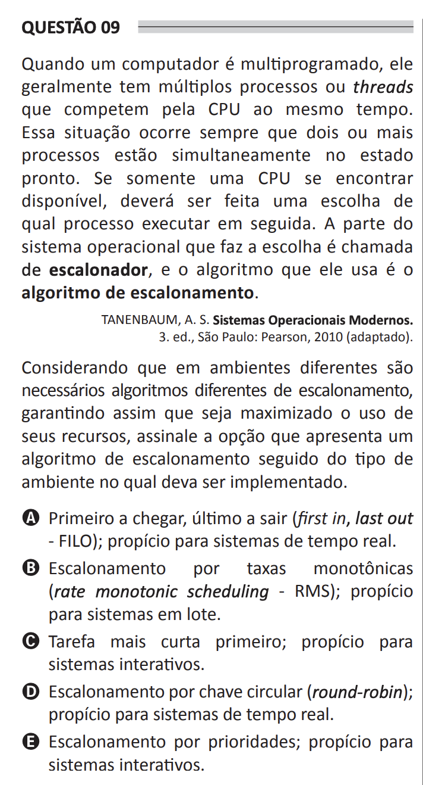

# ENADE 2021 Computer Science - Question 09

## Original question image

## English translation

When a computer is multiprogrammed, it usually has multiple processes or threads competing for the CPU at the same time. This situation occurs whenever two or more processes are simultaneously in the ready state. If only one CPU is available, a choice must be made about which process should execute next. The part of the operating system that makes this choice is called the scheduler, and the algorithm it uses is the scheduling algorithm.

TANENBAUM, A. S. Modern Operating Systems. 3rd ed. São Paulo: Pearson, 2010 (adapted).

Considering that different environments require different scheduling algorithms, thus ensuring that the use of their resources is maximized, choose the option that presents a scheduling algorithm followed by the type of environment in which it should be implemented.

A. First in, last out (FILO); suitable for real-time systems.  
B. Rate monotonic scheduling (RMS); suitable for batch systems.  
C. Shortest job first; suitable for interactive systems.  
D. Round-robin scheduling; suitable for real-time systems.  
E. Priority scheduling; suitable for interactive systems.

## Prompt

Answer the question(s) in this image by explaining step by step the reasoning used to answer it/them. Inform if any question is not clear or does not have a possible answer.
