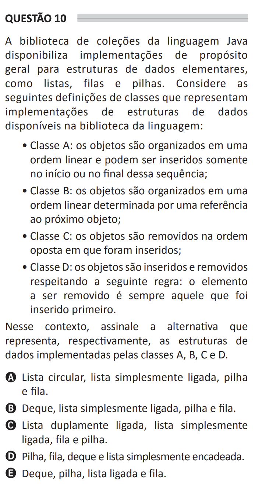

# ENADE 2021 Computer Science - Question 10

## Original question image

## English translation

The Java Collections library provides general-purpose implementations for elementary data structures, such as lists, queues, and stacks. Consider the following class definitions that represent implementations of data structures available in the language library:

- Class A: objects are organized in a linear order and can be inserted only at the beginning or at the end of this sequence;
- Class B: objects are organized in a linear order determined by a reference to the next object;
- Class C: objects are removed in the opposite order in which they were inserted;
- Class D: objects are inserted and removed according to the following rule: the element to be removed is always the one that was inserted first.

In this context, choose the alternative that respectively represents the data structures implemented by Classes A, B, C, and D.

A. Circular list, singly linked list, stack, and queue.  
B. Deque, singly linked list, stack, and queue.  
C. Doubly linked list, singly linked list, queue, and stack.  
D. Stack, queue, deque, and singly linked list.  
E. Deque, stack, linked list, and queue.

## Prompt

Answer the question(s) in this image by explaining step by step the reasoning used to answer it/them. Inform if any question is not clear or does not have a possible answer.
