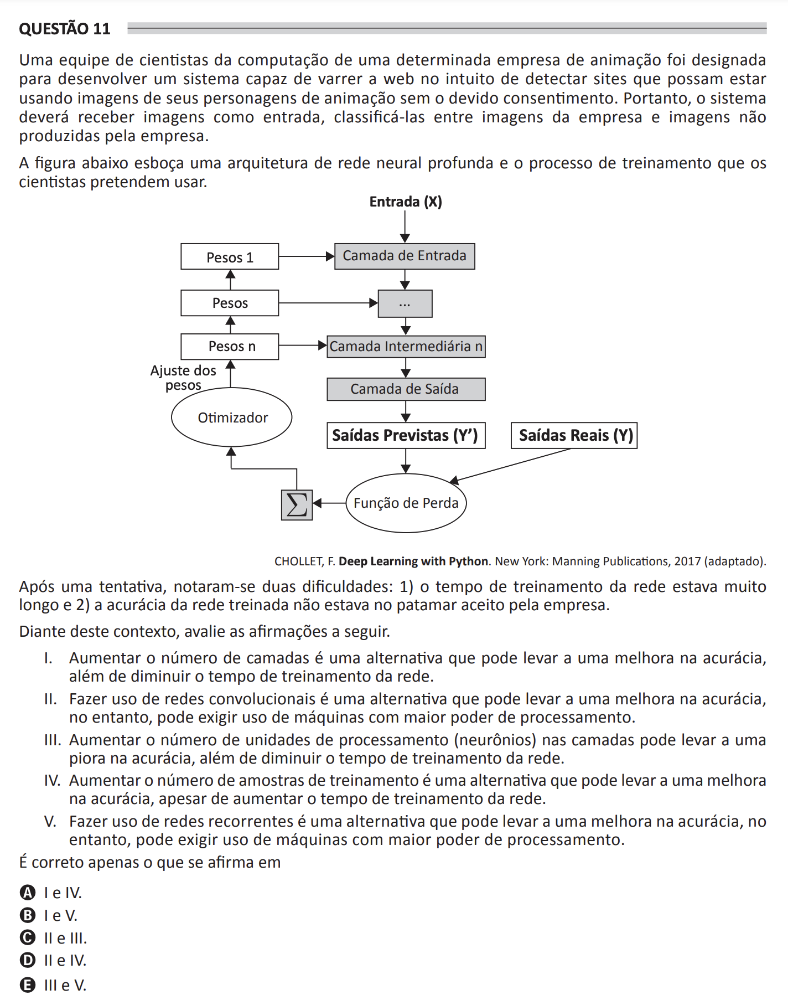

# ENADE 2021 Computer Science - Question 11

## Original question image

## English translation

A team of computer scientists from an animation company was assigned to develop a system capable of crawling the web in order to detect websites that may be using images of the company’s animated characters without proper consent. Therefore, the system should receive images as input and classify them as either images belonging to the company or images not produced by the company.

The figure below outlines a deep neural network architecture and the training process that the scientists intend to use.

After one attempt, two difficulties were noticed: (1) the network training time was very long and (2) the accuracy of the trained network did not reach the level accepted by the company.

Given this context, evaluate the following statements.

I. Increasing the number of layers is an alternative that may improve accuracy, as well as reduce the network training time.  
II. Using convolutional networks is an alternative that may improve accuracy; however, it may require machines with greater processing power.  
III. Increasing the number of processing units, or neurons, in the layers may lead to worse accuracy, as well as reduce the network training time.  
IV. Increasing the number of training samples is an alternative that may improve accuracy, although it increases the network training time.  
V. Using recurrent networks is an alternative that may improve accuracy; however, it may require machines with greater processing power.

It is correct only what is stated in:

A. I and IV.  
B. I and V.  
C. II and III.  
D. II and IV.  
E. III and V.

## Prompt

Answer the question(s) in this image by explaining step by step the reasoning used to answer it/them. Inform if any question is not clear or does not have a possible answer.
