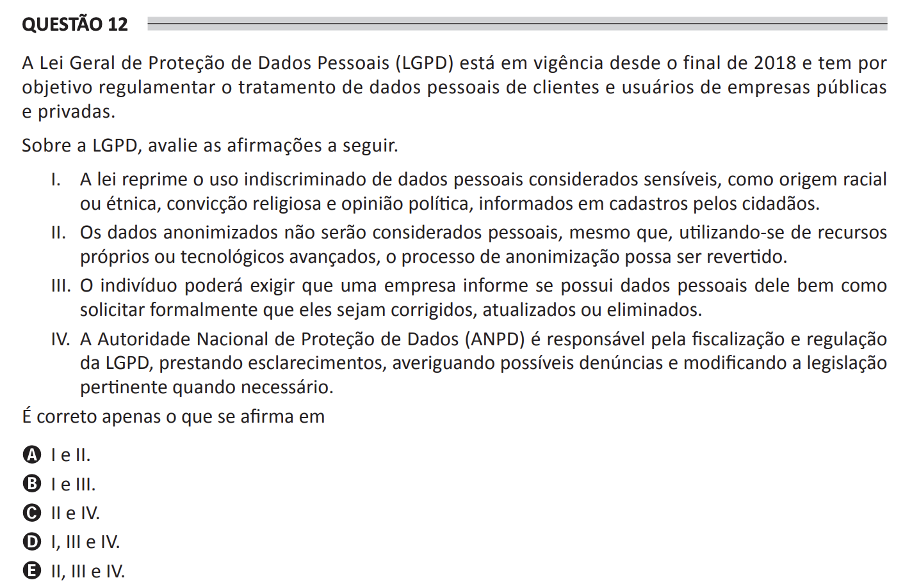

# ENADE 2021 Computer Science - Question 12

## Original question image

## English translation

The Brazilian General Data Protection Law (LGPD) has been in force since the end of 2018 and aims to regulate the processing of personal data of clients and users of public and private companies.

Regarding the LGPD, evaluate the following statements.

I. The law restricts the indiscriminate use of personal data considered sensitive, such as racial or ethnic origin, religious belief, and political opinion, informed in citizens’ records.  
II. Anonymized data will not be considered personal data, even if, by using one’s own or advanced technological resources, the anonymization process can be reversed.  
III. The individual may require a company to inform whether it has personal data about them, as well as formally request that such data be corrected, updated, or deleted.  
IV. The National Data Protection Authority (ANPD) is responsible for supervising and regulating the LGPD, providing clarifications, investigating possible complaints, and modifying the relevant legislation whenever necessary.

It is correct only what is stated in:

A. I and II.  
B. I and III.  
C. II and IV.  
D. I, III, and IV.  
E. II, III, and IV.

## Prompt

Answer the question(s) in this image by explaining step by step the reasoning used to answer it/them. Inform if any question is not clear or does not have a possible answer.
