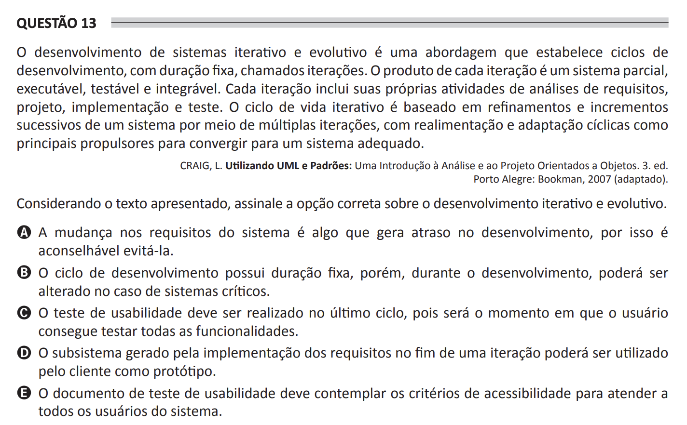

# ENADE 2021 Computer Science - Question 13

## Original question image

## English translation

Iterative and evolutionary software development is an approach that establishes development cycles of fixed duration, called iterations. The product of each iteration is a partial, executable, testable, and integrable system. Each iteration includes its own activities of requirements analysis, design, implementation, and testing. The iterative life cycle is based on successive refinements and increments of a system through multiple iterations, with realization and cyclic adaptation as the main drivers for converging toward an adequate system.

CRAIG, L. Applying UML and Patterns: An Introduction to Object-Oriented Analysis and Design. 3rd ed. Porto Alegre: Bookman, 2007 (adapted).

Considering the text presented, choose the correct option about iterative and evolutionary development.

A. Changes in system requirements cause delays in development, so it is advisable to avoid them.  
B. The development cycle has a fixed duration; however, during development, it may be changed in the case of critical systems.  
C. The usability test should be performed in the last cycle, since that will be the moment when the user can test all functionalities.  
D. The subsystem generated by the implementation of the requirements at the end of an iteration may be used by the client as a prototype.  
E. The usability test document should include accessibility criteria in order to serve all users of the system.

## Prompt

Answer the question(s) in this image by explaining step by step the reasoning used to answer it/them. Inform if any question is not clear or does not have a possible answer.
