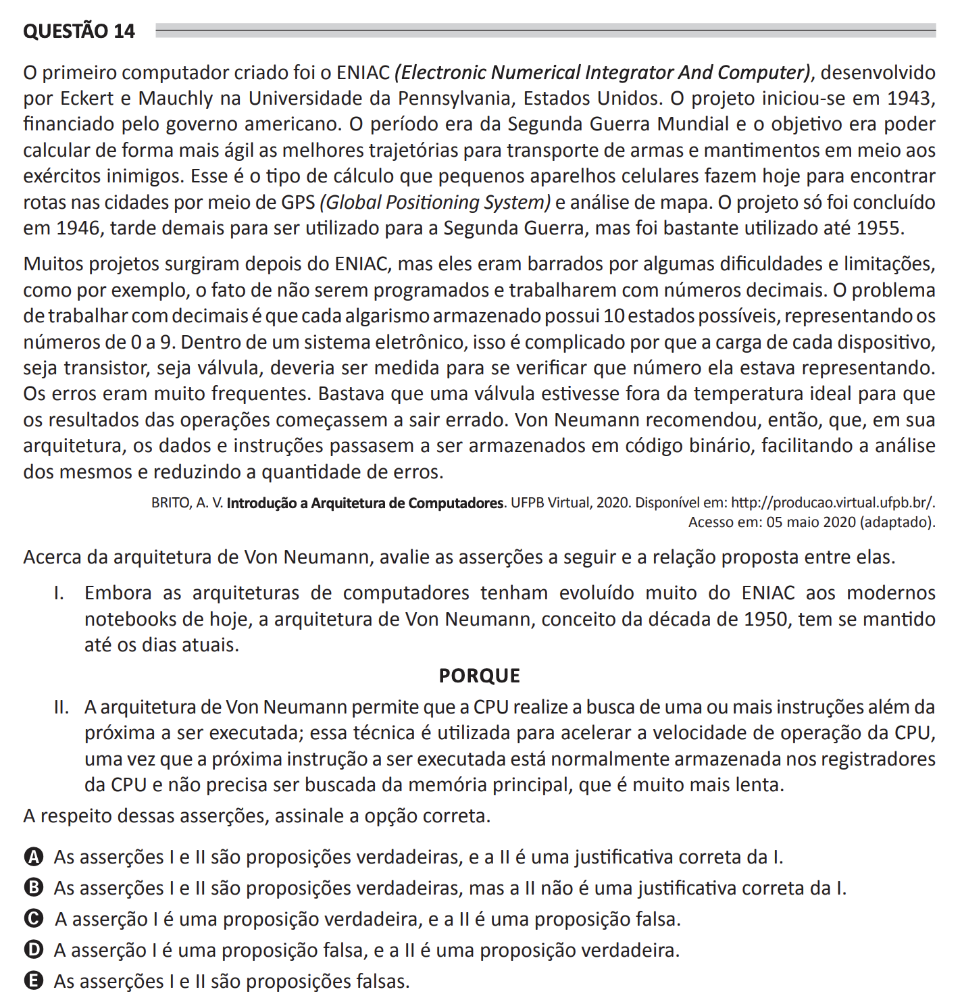

# ENADE 2021 Computer Science - Question 14

## Original question image

## English translation

The first computer created was ENIAC (Electronic Numerical Integrator and Computer), developed by Eckert and Mauchly at the University of Pennsylvania, United States. The project began in 1943, funded by the American government. The period was that of World War II, and the objective was to calculate more quickly the best trajectories for transporting weapons and supplies among enemy armies. This is the type of calculation that small cell phones perform today to find routes in cities using GPS (Global Positioning System) and map analysis. The project was completed only in 1946, too late to be used in World War II, but it was widely used until 1955.

Many projects emerged after ENIAC, but they were hindered by some difficulties and limitations, such as not being programmable and working with decimal numbers. The problem with working with decimals is that each stored digit has 10 possible states, representing the numbers from 0 to 9. In an electronic system, this is complicated because the charge of each device, whether transistor or valve, would have to be measured to verify which number it represented. Errors were very frequent. It was enough for a valve to be outside the ideal temperature for the results of operations to start coming out wrong. Von Neumann then recommended that, in his architecture, data and instructions should be stored in binary code, facilitating their analysis and reducing the number of errors.

Regarding the Von Neumann architecture, evaluate the following assertions and the relationship proposed between them.

I. Although computer architectures have evolved greatly from ENIAC to modern notebooks, the Von Neumann architecture, a concept from the 1950s, has remained in use to this day.

BECAUSE

II. The Von Neumann architecture allows the CPU to fetch one or more instructions beyond the next one to be executed; this technique is used to speed up CPU operation, since the next instruction to be executed is normally stored in CPU registers and does not need to be fetched from main memory, which is much slower.

Regarding these assertions, choose the correct option.

A. Assertions I and II are true, and II is a correct justification for I.  
B. Assertions I and II are true, but II is not a correct justification for I.  
C. Assertion I is true, and assertion II is false.  
D. Assertion I is false, and assertion II is true.  
E. Assertions I and II are false.

## Prompt

Answer the question(s) in this image by explaining step by step the reasoning used to answer it/them. Inform if any question is not clear or does not have a possible answer.
