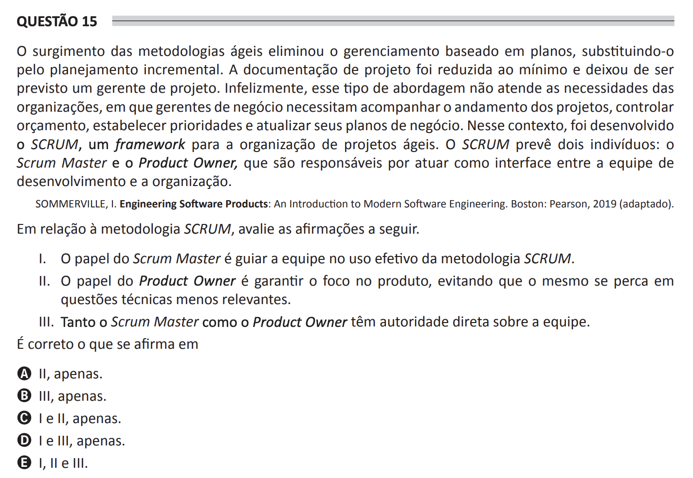

# ENADE 2021 Computer Science - Question 15

## Original question image

## English translation

The emergence of agile methodologies eliminated plan-based management, replacing it with incremental planning. Project documentation was reduced to a minimum, and the role of project manager was no longer expected. Unfortunately, this type of approach does not meet the needs of organizations in which business managers need to monitor project progress, control budgets, establish priorities, and update their business plans. In this context, SCRUM was developed, a framework for organizing agile projects. SCRUM defines two individuals: the Scrum Master and the Product Owner, who are responsible for acting as the interface between the development team and the organization.

SOMMERVILLE, I. Engineering Software Products: An Introduction to Modern Software Engineering. Boston: Pearson, 2019 (adapted).

Regarding the SCRUM methodology, evaluate the following statements.

I. The role of the Scrum Master is to guide the team in the effective use of the SCRUM methodology.  
II. The role of the Product Owner is to ensure focus on the product, preventing it from being lost in less relevant technical issues.  
III. Both the Scrum Master and the Product Owner have direct authority over the team.

It is correct what is stated in:

A. II only.  
B. III only.  
C. I and II only.  
D. I and III only.  
E. I, II, and III.

## Prompt

Answer the question(s) in this image by explaining step by step the reasoning used to answer it/them. Inform if any question is not clear or does not have a possible answer.
