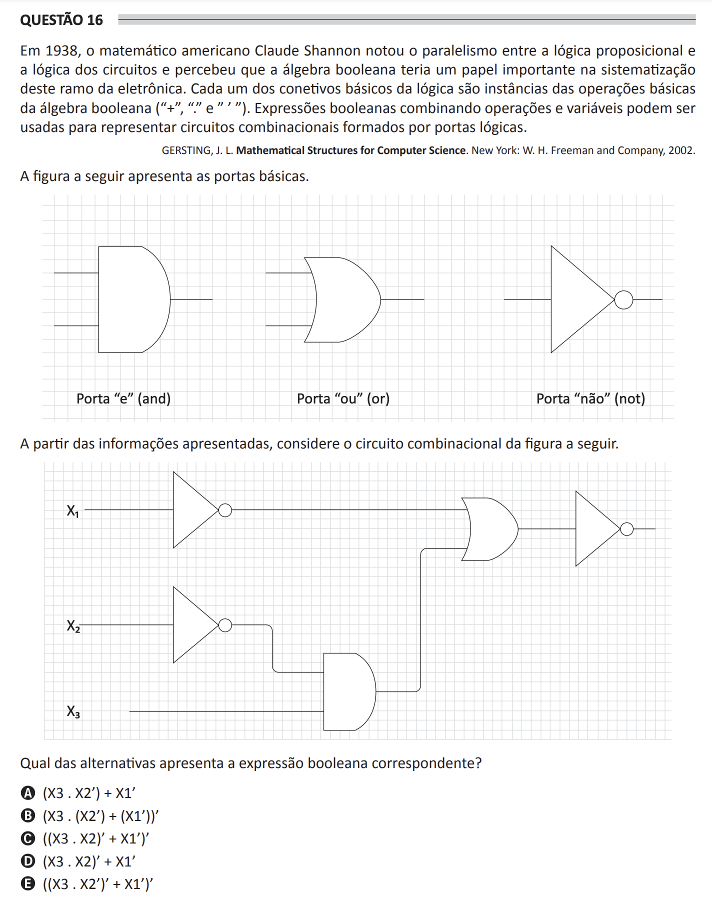

# ENADE 2021 Computer Science - Question 16

## Original question image

## English translation

In 1938, the American mathematician Claude Shannon noticed the parallelism between propositional logic and circuit logic and realized that Boolean algebra would play an important role in systematizing this branch of electronics. Each of the basic logical connectives is an instance of the basic operations of Boolean algebra (“+”, “.”, and “ ’ ”). Boolean expressions combining operations and variables can be used to represent combinational circuits formed by logic gates.

The figure shows the basic gates: AND, OR, and NOT.

Based on the information presented, consider the combinational circuit shown in the following figure.

Which alternative presents the corresponding Boolean expression?

A. (X3 . X2’) + X1’  
B. (X3 . (X2’) + (X1’))’  
C. ((X3 . X2)’ + X1’)’  
D. (X3 . X2)’ + X1’  
E. ((X3 . X2’) + X1’)’

## Prompt

Answer the question(s) in this image by explaining step by step the reasoning used to answer it/them. Inform if any question is not clear or does not have a possible answer.
