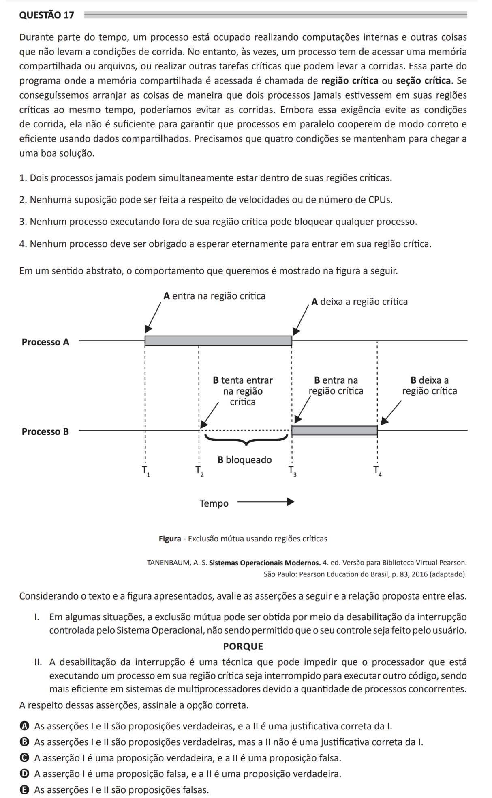

# ENADE 2021 Computer Science - Question 17

## Original question image

## English translation

During part of the time, a process is busy performing internal computations and other activities that do not lead to race conditions. However, sometimes a process has to access shared memory or files, or perform other critical tasks that may lead to races. The part of the program where the shared memory is accessed is called the critical region or critical section. If we could arrange things so that two processes never stayed in their critical regions at the same time, we could avoid races. Although this requirement avoids race conditions, it is not sufficient to ensure that parallel processes cooperate correctly and efficiently using shared data. Four conditions must hold in order to achieve a good solution.

1. Two processes must never be simultaneously inside their critical regions.  
2. No assumption may be made about speeds or number of CPUs.  
3. No process executing outside its critical region may block any process.  
4. No process should be forced to wait forever to enter its critical region.

In an abstract sense, the desired behavior is shown in the figure.

Considering the text and the figure presented, evaluate the following assertions and the relationship proposed between them.

I. In some situations, mutual exclusion can be achieved by disabling interrupts controlled by the Operating System, and users are not allowed to control it.

BECAUSE

II. Disabling interrupts is a technique that can prevent the processor executing a process in its critical region from being interrupted to execute other code, being more efficient in multiprocessor systems due to the number of concurrent processes.

Regarding these assertions, choose the correct option.

A. Assertions I and II are true, and II is a correct justification for I.  
B. Assertions I and II are true, but II is not a correct justification for I.  
C. Assertion I is true, and assertion II is false.  
D. Assertion I is false, and assertion II is true.  
E. Assertions I and II are false.

## Prompt

Answer the question(s) in this image by explaining step by step the reasoning used to answer it/them. Inform if any question is not clear or does not have a possible answer.
