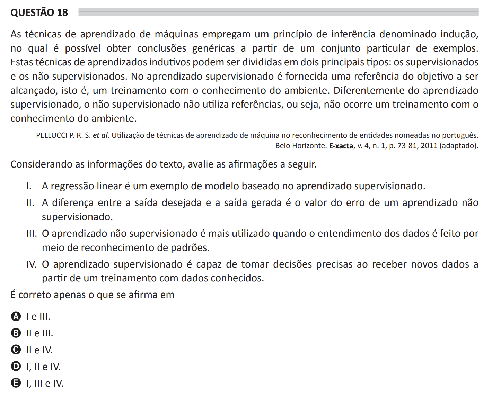

# ENADE 2021 Computer Science - Question 18

## Original question image

## English translation

Machine learning techniques employ an inference principle called induction, by which it is possible to obtain generic conclusions from a particular set of examples. These inductive learning techniques can be divided into two main types: supervised and unsupervised. In supervised learning, a reference for the objective to be achieved is provided, that is, training with knowledge of the environment. Differently from supervised learning, unsupervised learning does not use references, that is, there is no training with knowledge of the environment.

Considering the information in the text, evaluate the following statements.

I. Linear regression is an example of a model based on supervised learning.  
II. The difference between the desired output and the generated output is the error value of unsupervised learning.  
III. Unsupervised learning is most commonly used when understanding data is done through pattern recognition.  
IV. Supervised learning is capable of making accurate decisions when receiving new data based on training with known data.

It is correct only what is stated in:

A. I and III.  
B. II and III.  
C. II and IV.  
D. I, II, and IV.  
E. I, III, and IV.

## Prompt

Answer the question(s) in this image by explaining step by step the reasoning used to answer it/them. Inform if any question is not clear or does not have a possible answer.
