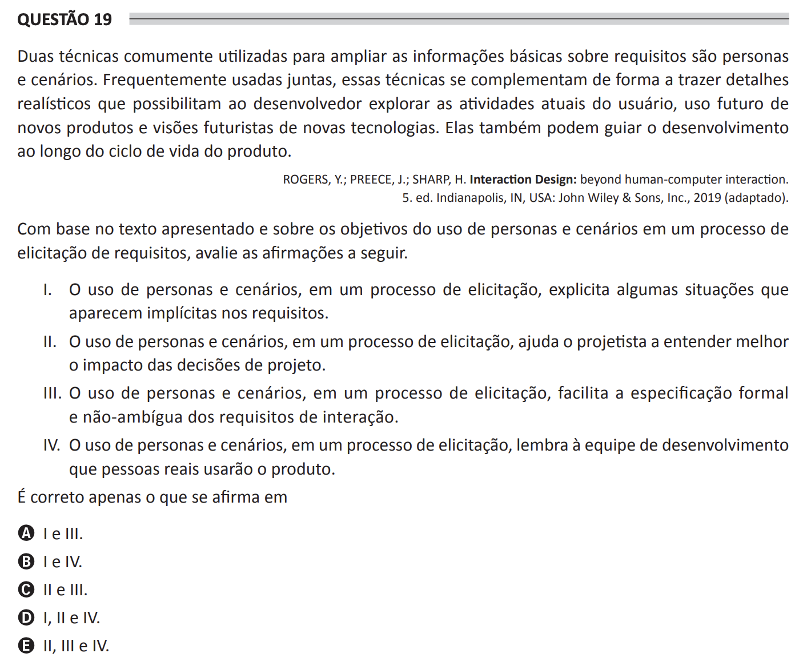

# ENADE 2021 Computer Science - Question 19

## Original question image

## English translation

Two techniques commonly used to expand basic information about requirements are personas and scenarios. Frequently used together, these techniques complement each other by bringing realistic details that enable the developer to explore the user’s current activities, the future use of new products, and futuristic views of new technologies. They may also guide development throughout the product life cycle.

ROGERS, Y.; PREECE, J.; SHARP, H. Interaction Design: Beyond Human-Computer Interaction. 5th ed. Indianapolis, IN, USA: John Wiley & Sons, Inc., 2019 (adapted).

Based on the text presented and on the objectives of using personas and scenarios in a requirements elicitation process, evaluate the following statements.

I. The use of personas and scenarios in an elicitation process makes explicit some situations that appear implicit in the requirements.  
II. The use of personas and scenarios in an elicitation process helps the designer better understand the impact of design decisions.  
III. The use of personas and scenarios in an elicitation process facilitates the formal and unambiguous specification of interaction requirements.  
IV. The use of personas and scenarios in an elicitation process reminds the development team that real people will use the product.

It is correct only what is stated in:

A. I and III.  
B. I and IV.  
C. II and III.  
D. I, II, and IV.  
E. II, III, and IV.

## Prompt

Answer the question(s) in this image by explaining step by step the reasoning used to answer it/them. Inform if any question is not clear or does not have a possible answer.
