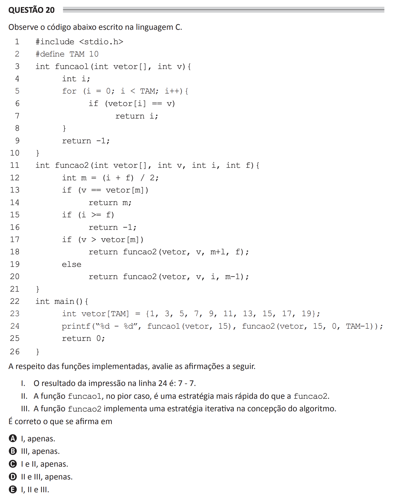

# ENADE 2021 Computer Science - Question 20

## Original question image



## English translation

Observe the following code written in the C language.

```c
#include <stdio.h>
#define TAM 10

int funcao1(int vetor[], int v) {
    int i;
    for (i = 0; i < TAM; i++) {
        if (vetor[i] == v)
            return i;
    }
    return -1;
}

int funcao2(int vetor[], int v, int i, int f) {
    int m = (i + f) / 2;
    if (v == vetor[m])
        return m;
    if (i >= f)
        return -1;
    if (v > vetor[m])
        return funcao2(vetor, v, m + 1, f);
    else
        return funcao2(vetor, v, i, m - 1);
}

int main() {
    int vetor[TAM] = {1, 3, 5, 7, 9, 11, 13, 15, 17, 19};
    printf("%d - %d", funcao1(vetor, 15), funcao2(vetor, 15, 0, TAM - 1));
    return 0;
}
```

Regarding the implemented functions, evaluate the following statements.

I. The result printed on line 24 is: 7 - 7.  
II. The function `funcao1`, in the worst case, is a faster strategy than `funcao2`.  
III. The function `funcao2` implements an iterative strategy in the algorithm design.

It is correct what is stated in:

A. I only.  
B. III only.  
C. I and II only.  
D. II and III only.  
E. I, II, and III.

## Prompt

Answer the question(s) in this image by explaining step by step the reasoning used to answer it/them. Inform if any question is not clear or does not have a possible answer.
