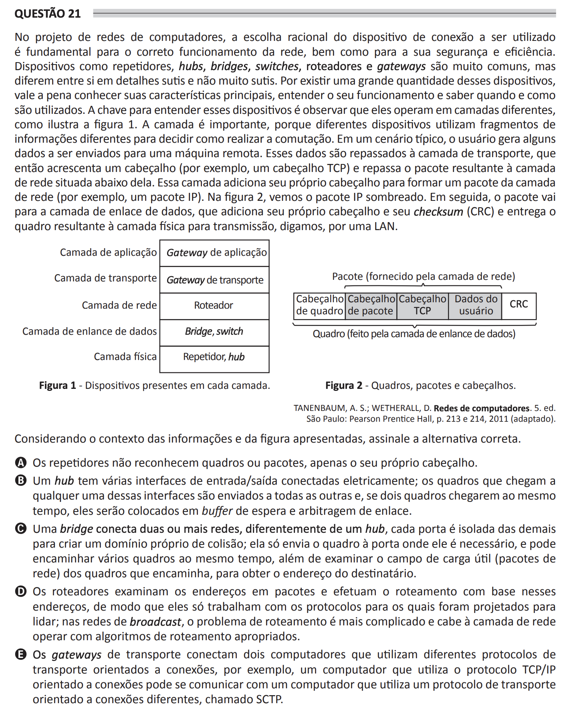

# ENADE 2021 Computer Science - Question 21

## Original question image

## English translation

In the design of computer networks, the rational choice of the connection device to be used is fundamental for the correct functioning of the network, as well as for its security and efficiency. Devices such as repeaters, hubs, bridges, switches, routers, and gateways are very common, but they differ from each other in subtle and not-so-subtle details. Because there is a large number of these devices, it is worth knowing their main characteristics, understanding how they work, and knowing when they are used. The key to understanding these devices is to observe that they operate at different layers, as shown in Figure 1. The layer is important because different devices use different fragments of information to decide how to perform switching. In a typical scenario, the user generates some data to be sent to a remote machine. These data are passed to the transport layer, which adds a header, for example a TCP header, and passes the resulting packet to the network layer below it. This layer adds its own header to form a network-layer packet, for example an IP packet. In Figure 2, the IP packet is shaded. Then, the packet goes to the data link layer, which adds its own header and checksum (CRC) and delivers the resulting frame to the physical layer for transmission, say, over a LAN.

Considering the context of the information and the figure presented, choose the correct alternative.

A. Repeaters do not recognize frames or packets, only their own header.  
B. A hub has several electrically connected input/output interfaces; frames that arrive at any of these interfaces are sent to all the others and, if two frames arrive at the same time, they are placed in a waiting buffer and link arbitration is performed.  
C. A bridge connects two or more networks; unlike a hub, each port is isolated from the others to create its own collision domain; it only sends the frame to the port where it is needed, and it may forward several frames at the same time, in addition to examining the payload field, or network packets, of the frames it forwards in order to obtain the destination address.  
D. Routers examine addresses in packets and perform routing based on these addresses, so that they only work with the protocols they were designed to handle; in broadcast networks, the routing problem is more complicated and it is up to the network layer to operate with appropriate routing algorithms.  
E. Transport gateways connect two computers that use different connection-oriented transport protocols; for example, a computer that uses the connection-oriented TCP/IP protocol may communicate with a computer that uses a different connection-oriented transport protocol called SCTP.

## Prompt

Answer the question(s) in this image by explaining step by step the reasoning used to answer it/them. Inform if any question is not clear or does not have a possible answer.
