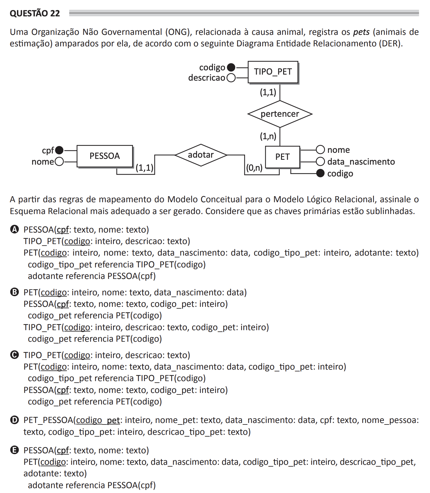

# ENADE 2021 Computer Science - Question 22

## Original question image

## English translation

A Non-Governmental Organization (NGO) related to the animal cause registers the pets sheltered by it according to the following Entity-Relationship Diagram (ERD).

Based on the mapping rules from the Conceptual Model to the Relational Logical Model, choose the most adequate Relational Schema to be generated. Consider that primary keys are underlined.

A.  
PESSOA(cpf: text, nome: text)  
TIPO_PET(codigo: integer, descricao: text)  
PET(codigo: integer, nome: text, data_nascimento: date, codigo_tipo_pet: integer, adotante: text)  
codigo_tipo_pet references TIPO_PET(codigo)  
adotante references PESSOA(cpf)

B.  
PET(codigo: integer, nome: text, data_nascimento: date)  
PESSOA(cpf: text, nome: text, codigo_pet: integer)  
codigo_pet references PET(codigo)  
TIPO_PET(codigo: integer, descricao: text, codigo_pet: integer)  
codigo_pet references PET(codigo)

C.  
TIPO_PET(codigo: integer, descricao: text)  
PET(codigo: integer, nome: text, data_nascimento: date, codigo_tipo_pet: integer)  
codigo_tipo_pet references TIPO_PET(codigo)  
PESSOA(cpf: text, nome: text, codigo_pet: integer)  
codigo_pet references PET(codigo)

D.  
PET_PESSOA(codigo_pet: integer, nome_pet: text, data_nascimento: date, cpf: text, nome_pessoa: text, codigo_tipo_pet: integer, descricao_tipo_pet: text)

E.  
PESSOA(cpf: text, nome: text)  
PET(codigo: integer, nome: text, data_nascimento: date, codigo_tipo_pet: integer, descricao_tipo_pet, adotante: text)  
adotante references PESSOA(cpf)

## Prompt

Answer the question(s) in this image by explaining step by step the reasoning used to answer it/them. Inform if any question is not clear or does not have a possible answer.
