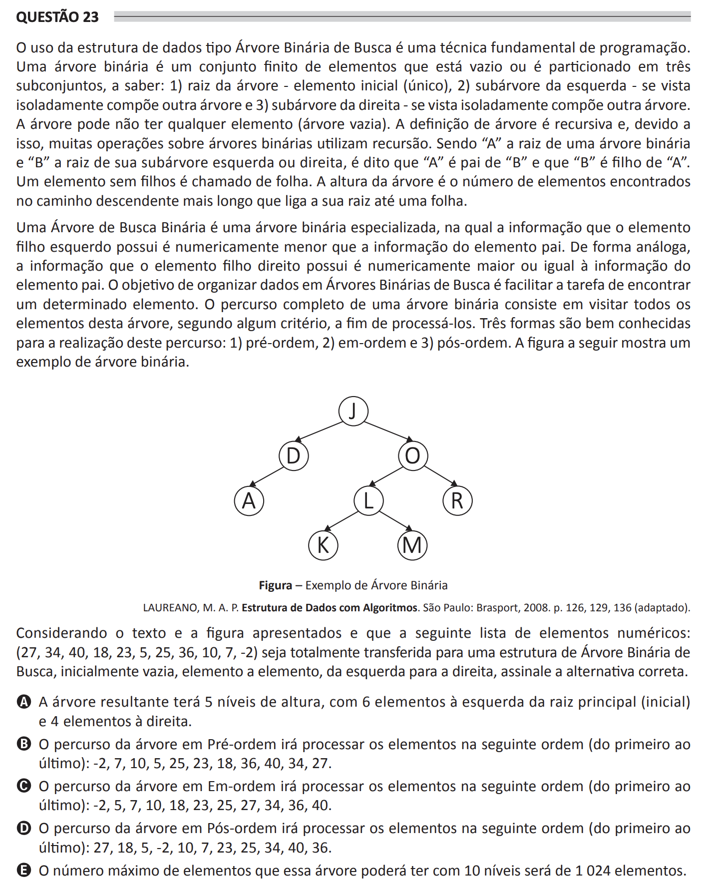

# ENADE 2021 Computer Science - Question 23

## Original question image

## English translation

The use of the Binary Search Tree data structure is a fundamental programming technique. A binary tree is a finite set of elements that is either empty or partitioned into three subsets, namely: (1) the root of the tree, the initial and unique element; (2) the left subtree, which, when viewed separately, forms another tree; and (3) the right subtree, which, when viewed separately, forms another tree. The tree may have no elements, that is, it may be empty. The definition of a tree is recursive, and because of this, many operations on binary trees use recursion. If “A” is the root of a binary tree and “B” is the root of its left or right subtree, then “A” is said to be the parent of “B” and “B” is said to be a child of “A”. An element without children is called a leaf. The height of a tree is the number of elements found along the longest descending path from its root to a leaf.

A Binary Search Tree is a specialized binary tree in which the information held by the left child is numerically less than the information of the parent element. Similarly, the information held by the right child is numerically greater than or equal to the information of the parent element. The goal of organizing data in Binary Search Trees is to facilitate the task of finding a given element. A complete traversal of a binary tree consists of visiting all elements of that tree according to some criterion in order to process them. Three well-known traversal forms are: (1) pre-order, (2) in-order, and (3) post-order. The figure shows an example of a binary tree.

Considering the text and the figure presented, and considering that the following list of numerical elements `(27, 34, 40, 18, 23, 5, 25, 36, 10, 7, -2)` is entirely transferred to an initially empty Binary Search Tree, element by element from left to right, choose the correct alternative.

A. The resulting tree will have 5 levels of height, with 6 elements to the left of the main, initial root and 4 elements to the right.  
B. The pre-order traversal of the tree will process the elements in the following order, from first to last: -2, 7, 10, 5, 25, 23, 18, 36, 40, 34, 27.  
C. The in-order traversal of the tree will process the elements in the following order, from first to last: -2, 5, 7, 10, 18, 23, 25, 27, 34, 36, 40.  
D. The post-order traversal of the tree will process the elements in the following order, from first to last: 27, 18, 5, -2, 10, 7, 23, 25, 34, 40, 36.  
E. The maximum number of elements that this tree could have with 10 levels would be 1,024 elements.

## Prompt

Answer the question(s) in this image by explaining step by step the reasoning used to answer it/them. Inform if any question is not clear or does not have a possible answer.
