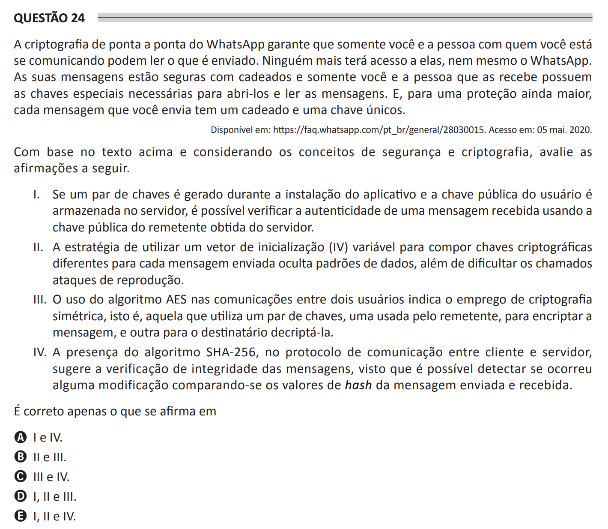

# ENADE 2021 Computer Science - Question 24

## Original question image

## English translation

WhatsApp end-to-end encryption ensures that only you and the person you are communicating with can read what is sent. No one else will have access to them, not even WhatsApp. Your messages are secured with locks, and only you and the person who receives them have the special keys needed to unlock and read the messages. For even greater protection, each message you send has a unique lock and key.

Based on the text above and considering the concepts of security and cryptography, evaluate the following statements.

I. If a key pair is generated during application installation and the user’s public key is stored on the server, it is possible to verify the authenticity of a received message using the sender’s public key obtained from the server.  
II. The strategy of using a variable initialization vector (IV) to compose different cryptographic keys for each message sent hides data patterns, in addition to making replay attacks more difficult.  
III. The use of the AES algorithm in communications between two users indicates the use of symmetric cryptography, that is, cryptography that uses a pair of keys, one used by the sender to encrypt the message and another used by the recipient to decrypt it.  
IV. The presence of the SHA-256 algorithm in the communication protocol between client and server suggests message integrity verification, since it is possible to detect whether a modification has occurred by comparing the hash values of the sent and received message.

It is correct only what is stated in:

A. I and IV.  
B. II and III.  
C. III and IV.  
D. I, II, and III.  
E. I, II, and IV.

## Prompt

Answer the question(s) in this image by explaining step by step the reasoning used to answer it/them. Inform if any question is not clear or does not have a possible answer.
