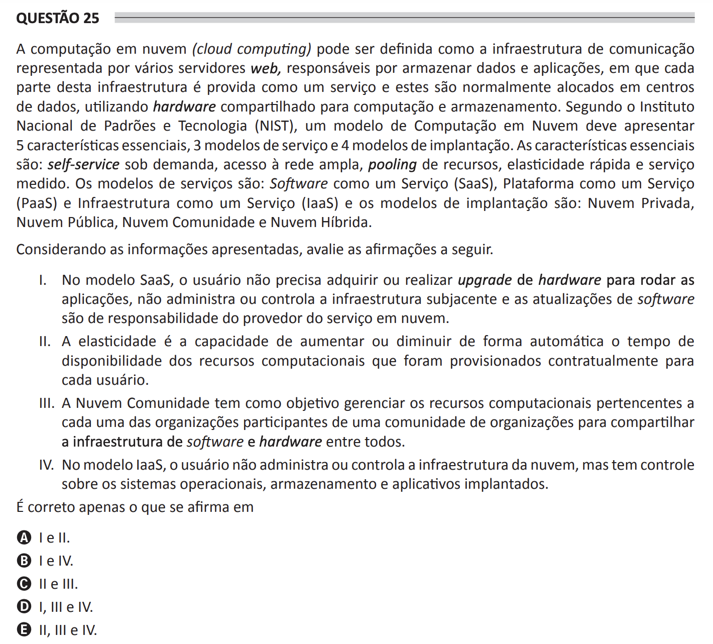

# ENADE 2021 Computer Science - Question 25

## Original question image

## English translation

Cloud computing may be defined as the communication infrastructure represented by several web servers responsible for storing data and applications, in which each part of this infrastructure is provided as a service and these services are usually allocated in data centers using shared hardware for computing and storage. According to the National Institute of Standards and Technology (NIST), a cloud computing model must present five essential characteristics, three service models, and four deployment models. The essential characteristics are: on-demand self-service, broad network access, resource pooling, rapid elasticity, and measured service. The service models are: Software as a Service (SaaS), Platform as a Service (PaaS), and Infrastructure as a Service (IaaS). The deployment models are: Private Cloud, Public Cloud, Community Cloud, and Hybrid Cloud.

Considering the information presented, evaluate the following statements.

I. In the SaaS model, the user does not need to acquire or upgrade hardware to run the applications, does not administer or control the underlying infrastructure, and software updates are the responsibility of the cloud service provider.  
II. Elasticity is the ability to automatically increase or decrease the availability time of computational resources that were contractually provisioned for each user.  
III. The Community Cloud aims to manage computational resources belonging to each of the organizations participating in a community of organizations in order to share the software and hardware infrastructure among all.  
IV. In the IaaS model, the user does not administer or control the cloud infrastructure, but has control over operating systems, storage, and deployed applications.

It is correct only what is stated in:

A. I and II.  
B. I and IV.  
C. II and III.  
D. I, III, and IV.  
E. II, III, and IV.

## Prompt

Answer the question(s) in this image by explaining step by step the reasoning used to answer it/them. Inform if any question is not clear or does not have a possible answer.
