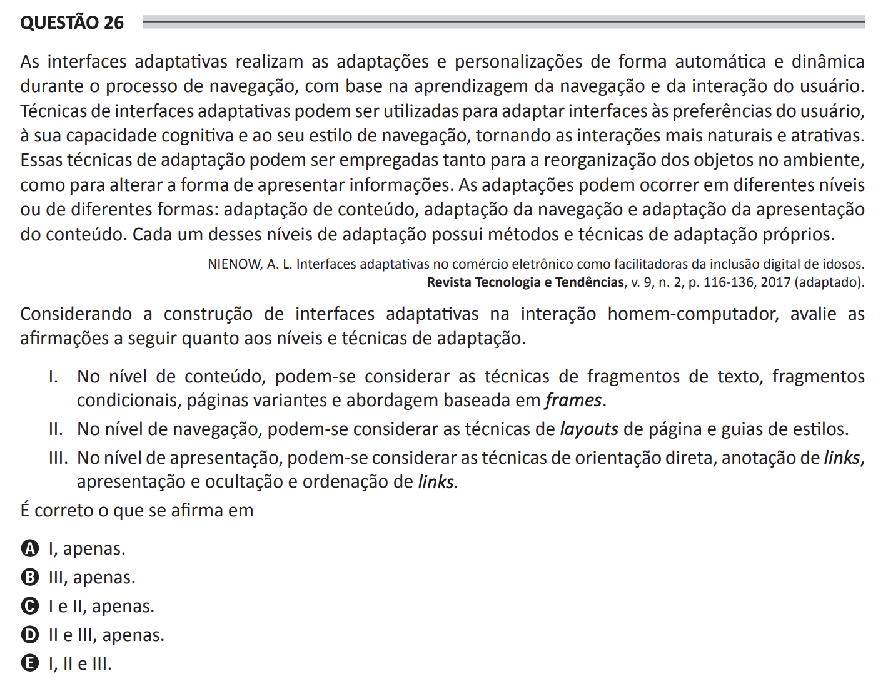

# ENADE 2021 Computer Science - Question 26

## Original question image

## English translation

Adaptive interfaces perform adaptations and customizations automatically and dynamically during the navigation process, based on the learning of the user’s navigation and interaction. Adaptive interface techniques may be used to adapt interfaces to user preferences, cognitive capacity, and navigation style, making interactions more natural and attractive. These adaptation techniques can be employed both to reorganize objects in the environment and to change the way information is presented. Adaptations may occur at different levels or in different forms: content adaptation, navigation adaptation, and content presentation adaptation. Each of these adaptation levels has its own adaptation methods and techniques.

Considering the construction of adaptive interfaces in human-computer interaction, evaluate the following statements regarding adaptation levels and techniques.

I. At the content level, techniques such as text fragments, conditional fragments, page variants, and frame-based approaches may be considered.  
II. At the navigation level, page layout techniques and style guides may be considered.  
III. At the presentation level, techniques such as direct guidance, link annotation, link presentation and hiding, and link ordering may be considered.

It is correct what is stated in:

A. I only.  
B. III only.  
C. I and II only.  
D. II and III only.  
E. I, II, and III.

## Prompt

Answer the question(s) in this image by explaining step by step the reasoning used to answer it/them. Inform if any question is not clear or does not have a possible answer.
