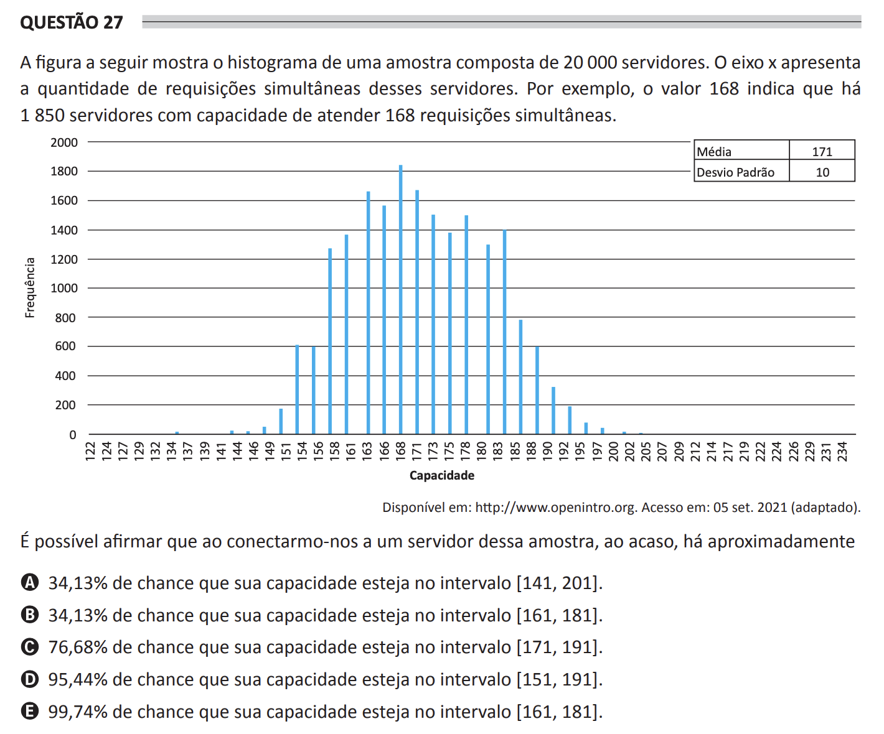

# ENADE 2021 Computer Science - Question 27

## Original question image

## English translation

The following figure shows the histogram of a sample composed of 20,000 servers. The x-axis represents the number of simultaneous requests these servers can handle. For example, the value 168 indicates that there are 1,850 servers with the capacity to handle 168 simultaneous requests.

The figure also indicates: mean = 171 and standard deviation = 10.

It is possible to state that, when randomly connecting to a server from this sample, there is approximately:

A. a 34.13% chance that its capacity is in the interval [141, 201].  
B. a 34.13% chance that its capacity is in the interval [161, 181].  
C. a 76.68% chance that its capacity is in the interval [171, 191].  
D. a 95.44% chance that its capacity is in the interval [151, 191].  
E. a 99.74% chance that its capacity is in the interval [161, 181].

## Prompt

Answer the question(s) in this image by explaining step by step the reasoning used to answer it/them. Inform if any question is not clear or does not have a possible answer.
