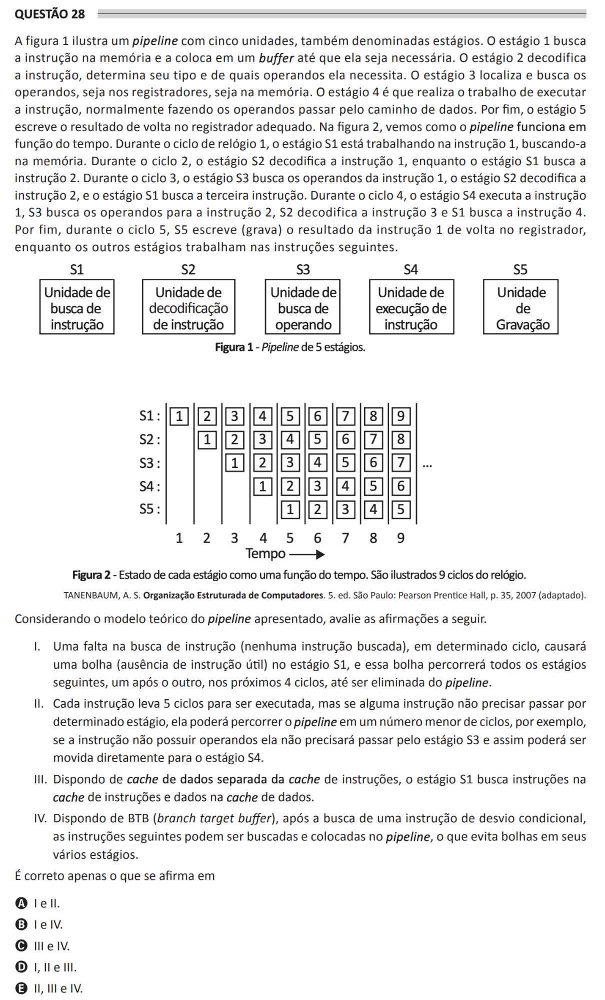

# ENADE 2021 Computer Science - Question 28

## Original question image

## English translation

Figure 1 illustrates a pipeline with five units, also called stages. Stage 1 fetches the instruction from memory and places it in a buffer until it is needed. Stage 2 decodes the instruction, determines its type, and determines which operands it needs. Stage 3 locates and fetches the operands, either in registers or in memory. Stage 4 performs the work of executing the instruction, usually making the operands pass through the data path. Finally, Stage 5 writes the result back to the appropriate register. Figure 2 shows how the pipeline works over time. During clock cycle 1, stage S1 is working on instruction 1, fetching it from memory. During cycle 2, stage S2 decodes instruction 1, while stage S1 fetches instruction 2. During cycle 3, stage S3 fetches the operands for instruction 1, stage S2 decodes instruction 2, and stage S1 fetches the third instruction. During cycle 4, stage S4 executes instruction 1, S3 fetches the operands for instruction 2, S2 decodes instruction 3, and S1 fetches instruction 4. Finally, during cycle 5, S5 writes the result of instruction 1 back to the register, while the other stages work on subsequent instructions.

Considering the theoretical pipeline model presented, evaluate the following statements.

I. A failure in instruction fetching, that is, no instruction fetched in a given cycle, will cause a bubble, meaning the absence of a useful instruction in stage S1, and this bubble will pass through all subsequent stages, one after another, in the next 4 cycles, until it is eliminated from the pipeline.  
II. Each instruction takes 5 cycles to be executed, but if an instruction does not need to pass through a given stage, it may go through the pipeline in fewer cycles; for example, if the instruction has no operands, it does not need to pass through stage S3 and may therefore move directly to stage S4.  
III. With a data cache separate from the instruction cache, stage S1 fetches instructions from the instruction cache and data from the data cache.  
IV. With a BTB (branch target buffer), after fetching a conditional branch instruction, the following instructions may be fetched and placed in the pipeline, which avoids bubbles in its various stages.

It is correct only what is stated in:

A. I and II.  
B. I and IV.  
C. III and IV.  
D. I, II, and III.  
E. II, III, and IV.

## Prompt

Answer the question(s) in this image by explaining step by step the reasoning used to answer it/them. Inform if any question is not clear or does not have a possible answer.
