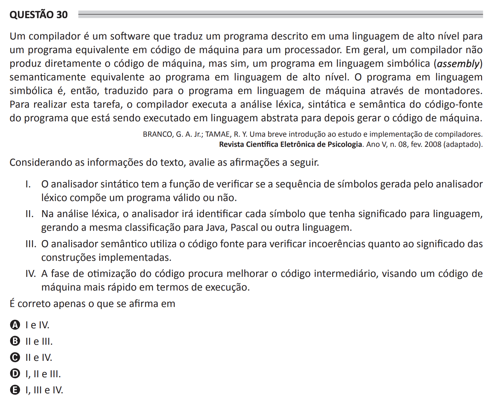

# ENADE 2021 Computer Science - Question 30

## Original question image

## English translation

A compiler is software that translates a program written in a high-level language into an equivalent program in machine code for a processor. In general, a compiler does not directly produce machine code, but rather a program in symbolic language (assembly) that is semantically equivalent to the program in the high-level language. The program in symbolic language is then translated into the program in machine language through assemblers. To perform this task, the compiler carries out lexical, syntactic, and semantic analysis of the source code of the program being executed in an abstract language and then generates the machine code.

BRANCO, G. A. Jr.; TAMAE, R. Y. A brief introduction to the study and implementation of compilers. Revista Científica Eletrônica de Psicologia. Year V, no. 08, Feb. 2008 (adapted).

Considering the information in the text, evaluate the following statements.

I. The parser has the function of verifying whether the sequence of symbols generated by the lexical analyzer composes a valid program or not.

II. In lexical analysis, the analyzer identifies each symbol that has meaning for the language, generating the same classification for Java, Pascal, or any other language.

III. The semantic analyzer uses the source code to check inconsistencies regarding the meaning of the implemented constructions.

IV. The code optimization phase seeks to improve the intermediate code, aiming at faster machine code in terms of execution.

It is correct only what is stated in:

A. I and IV.  
B. II and III.  
C. II and IV.  
D. I, II, and III.  
E. I, III, and IV.

## Prompt

Answer the question(s) in this image by explaining step by step the reasoning used to answer it/them. Inform if any question is not clear or does not have a possible answer.
