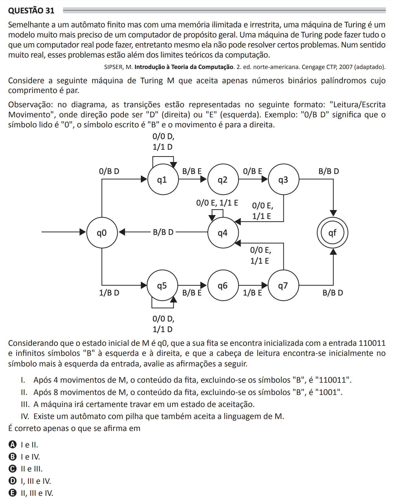

# ENADE 2021 Computer Science - Question 31

## Original question image

## English translation

Similar to a finite automaton but with unlimited and unrestricted memory, a Turing machine is a much more precise model of a general-purpose computer. A Turing machine can do everything a real computer can do; however, even it cannot solve certain problems. In a very real sense, these problems are beyond the theoretical limits of computation.

SIPSER, M. Introduction to the Theory of Computation. 2nd North American ed. Cengage CTP, 2007 (adapted).

Consider the following Turing machine M, which accepts only even-length binary palindromes.

Note: in the diagram, transitions are represented in the following format: “Read/Write Movement”, where the direction can be “D” (right) or “E” (left). Example: “0/B D” means that the symbol read is “0”, the symbol written is “B”, and the movement is to the right.

Considering that the initial state of M is q0, that its tape is initialized with the input 110011 and infinitely many symbols “B” to the left and to the right, and that the reading head is initially on the leftmost symbol of the input, evaluate the following statements.

I. After 4 movements of M, the tape content, excluding the “B” symbols, is “110011”.

II. After 8 movements of M, the tape content, excluding the “B” symbols, is “1001”.

III. The machine will certainly halt in an accepting state.

IV. There exists a pushdown automaton that also accepts the language of M.

It is correct only what is stated in:

A. I and II.  
B. I and IV.  
C. II and III.  
D. I, III, and IV.  
E. II, III, and IV.

## Prompt

Answer the question(s) in this image by explaining step by step the reasoning used to answer it/them. Inform if any question is not clear or does not have a possible answer.
