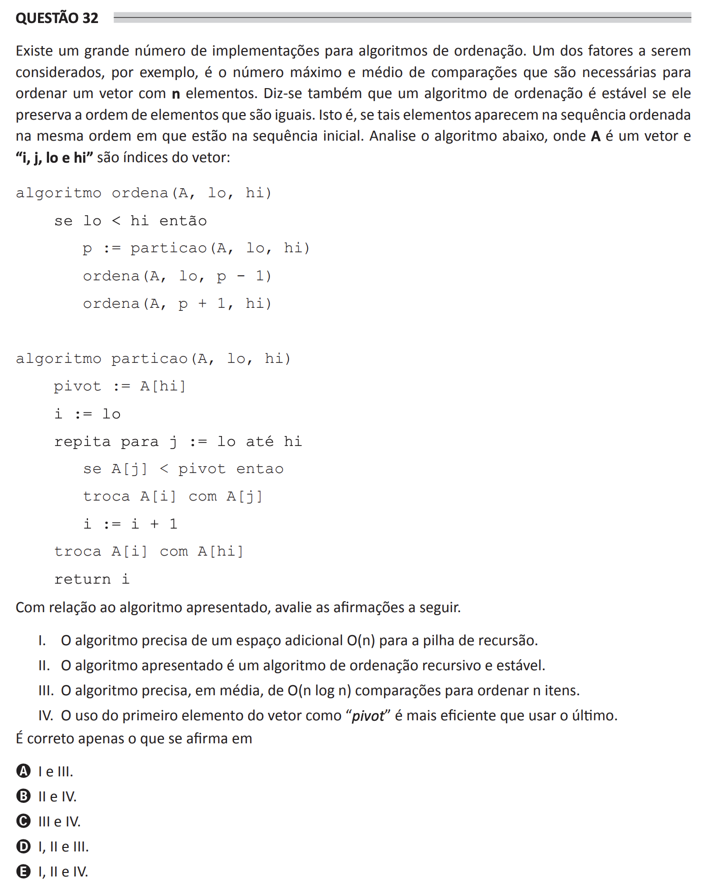

# ENADE 2021 Computer Science - Question 32

## Original question image



## English translation

There are a large number of implementations for sorting algorithms. One of the factors to be considered, for example, is the maximum and average number of comparisons needed to sort an array with n elements. It is also said that a sorting algorithm is stable if it preserves the order of elements that are equal. That is, if such elements appear in the sorted sequence in the same order in which they were in the initial sequence. Analyze the algorithm below, where A is an array and “i, j, lo and hi” are array indices:

```text
algorithm sort(A, lo, hi)

    if lo < hi then

        p := partition(A, lo, hi)

        sort(A, lo, p - 1)

        sort(A, p + 1, hi)


algorithm partition(A, lo, hi)

    pivot := A[hi]

    i := lo

    repeat for j := lo to hi

        if A[j] < pivot then

            swap A[i] with A[j]

            i := i + 1

    swap A[i] with A[hi]

    return i
```

Regarding the algorithm presented, evaluate the following statements.

I. The algorithm requires O(n) additional space for the recursion stack.

II. The algorithm presented is a recursive and stable sorting algorithm.

III. On average, the algorithm requires O(n log n) comparisons to sort n items.

IV. Using the first element of the array as the pivot is more efficient than using the last one.

It is correct only what is stated in:

A. I and III.  
B. II and IV.  
C. III and IV.  
D. I, II, and III.  
E. I, II, and IV.

## Prompt

Answer the question(s) in this image by explaining step by step the reasoning used to answer it/them. Inform if any question is not clear or does not have a possible answer.
